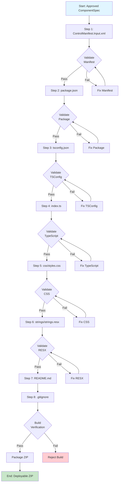

# Code Generation Pipeline Specification

## Executive Summary

The Code Generation Pipeline transforms an approved ComponentSpec into a complete, buildable PCF project. It generates files one at a time in dependency order, validates each file before proceeding, implements an error-fix loop for recoverable errors, verifies the build, and packages the result into a deployable ZIP.

**Core Principle**: Generate deterministically, validate continuously, fail fast.

---

## 1. File Generation Order

### 1.1 Generation Sequence

Files are generated in strict dependency order to ensure each file can reference previously generated artifacts.



### 1.2 File Generation Steps

```typescript
enum GenerationStep {
  MANIFEST = 1,      // ControlManifest.Input.xml
  PACKAGE = 2,       // package.json
  TSCONFIG = 3,      // tsconfig.json
  INDEX = 4,         // index.ts (main implementation)
  STYLES = 5,        // css/styles.css
  RESOURCES = 6,     // strings/strings.resx
  README = 7,        // README.md
  GITIGNORE = 8      // .gitignore
}

interface GenerationStepConfig {
  step: GenerationStep;
  fileName: string;
  outputPath: string;
  templatePath: string;
  validationType: ValidationType;
  required: boolean;
  dependsOn: GenerationStep[];
}

const GENERATION_STEPS: GenerationStepConfig[] = [
  {
    step: GenerationStep.MANIFEST,
    fileName: 'ControlManifest.Input.xml',
    outputPath: 'ControlManifest.Input.xml',
    templatePath: 'templates/ControlManifest.Input.xml.hbs',
    validationType: ValidationType.XML_SCHEMA,
    required: true,
    dependsOn: []
  },
  {
    step: GenerationStep.PACKAGE,
    fileName: 'package.json',
    outputPath: 'package.json',
    templatePath: 'templates/package.json.hbs',
    validationType: ValidationType.JSON_SCHEMA,
    required: true,
    dependsOn: [GenerationStep.MANIFEST]
  },
  {
    step: GenerationStep.TSCONFIG,
    fileName: 'tsconfig.json',
    outputPath: 'tsconfig.json',
    templatePath: 'templates/tsconfig.json.hbs',
    validationType: ValidationType.JSON_SCHEMA,
    required: true,
    dependsOn: [GenerationStep.PACKAGE]
  },
  {
    step: GenerationStep.INDEX,
    fileName: 'index.ts',
    outputPath: 'index.ts',
    templatePath: 'templates/index.ts.hbs',
    validationType: ValidationType.TYPESCRIPT,
    required: true,
    dependsOn: [GenerationStep.TSCONFIG]
  },
  {
    step: GenerationStep.STYLES,
    fileName: 'styles.css',
    outputPath: 'css/styles.css',
    templatePath: 'templates/styles.css.hbs',
    validationType: ValidationType.CSS,
    required: true,
    dependsOn: [GenerationStep.INDEX]
  },
  {
    step: GenerationStep.RESOURCES,
    fileName: 'strings.resx',
    outputPath: 'strings/strings.resx',
    templatePath: 'templates/strings.resx.hbs',
    validationType: ValidationType.XML_SCHEMA,
    required: true,
    dependsOn: [GenerationStep.STYLES]
  },
  {
    step: GenerationStep.README,
    fileName: 'README.md',
    outputPath: 'README.md',
    templatePath: 'templates/README.md.hbs',
    validationType: ValidationType.MARKDOWN,
    required: false,
    dependsOn: [GenerationStep.RESOURCES]
  },
  {
    step: GenerationStep.GITIGNORE,
    fileName: '.gitignore',
    outputPath: '.gitignore',
    templatePath: 'templates/.gitignore.hbs',
    validationType: ValidationType.NONE,
    required: false,
    dependsOn: [GenerationStep.README]
  }
];
```

### 1.3 Why This Order?

1. **ControlManifest.Input.xml first**: Defines component metadata, properties, and resources
2. **package.json second**: References component name from manifest
3. **tsconfig.json third**: TypeScript configuration for compilation
4. **index.ts fourth**: Main implementation, depends on tsconfig
5. **styles.css fifth**: Styles referenced in index.ts
6. **strings.resx sixth**: Localization resources referenced in index.ts
7. **README.md seventh**: Documentation, no code dependencies
8. **.gitignore last**: Project configuration, no code dependencies

---

## 2. Validation Points

### 2.1 Validation Types

```typescript
enum ValidationType {
  XML_SCHEMA = 'xml-schema',           // Validate XML against XSD
  JSON_SCHEMA = 'json-schema',         // Validate JSON against schema
  TYPESCRIPT = 'typescript',           // TypeScript compilation + linting
  CSS = 'css',                         // CSS linting
  MARKDOWN = 'markdown',               // Markdown linting (optional)
  NONE = 'none'                        // No validation
}
```

### 2.2 Validation Point Details

#### Validation Point 1: Manifest Schema

**File**: `ControlManifest.Input.xml`  
**Validator**: XML Schema (XSD)  
**Schema**: PCF ControlManifest XSD (from Microsoft)

```typescript
interface ManifestValidation {
  valid: boolean;
  errors: Array<{
    line: number;
    column: number;
    message: string;
  }>;
}

async function validateManifest(
  manifestXml: string
): Promise<ManifestValidation> {
  // Load PCF manifest XSD schema
  const xsd = await loadSchema('pcf-manifest.xsd');
  
  // Validate XML against schema
  const result = await xmlValidator.validate(manifestXml, xsd);
  
  return {
    valid: result.errors.length === 0,
    errors: result.errors
  };
}
```

**Checks**:
- Valid XML syntax
- Required elements present (control, property, resources)
- Property data types are valid PCF types
- Resource paths are valid
- Namespace follows conventions

---

#### Validation Point 2: Package JSON Schema

**File**: `package.json`  
**Validator**: JSON Schema  
**Schema**: npm package.json schema

```typescript
async function validatePackageJson(
  packageJson: string
): Promise<ValidationResult> {
  const schema = await loadSchema('package.json.schema');
  const ajv = new Ajv({ strict: true });
  const validate = ajv.compile(schema);
  
  const parsed = JSON.parse(packageJson);
  const valid = validate(parsed);
  
  return {
    valid,
    errors: validate.errors || []
  };
}
```

**Checks**:
- Valid JSON syntax
- Required fields present (name, version, dependencies)
- Dependencies are valid npm packages
- Scripts are properly defined

---

#### Validation Point 3: TypeScript Compilation

**File**: `index.ts`  
**Validator**: TypeScript compiler + ESLint  
**Configuration**: `tsconfig.json` + `.eslintrc.json`

```typescript
async function validateTypeScript(
  indexTs: string,
  tsconfig: any
): Promise<TypeScriptValidation> {
  // 1. TypeScript compilation
  const compileResult = await tsc.compile(indexTs, tsconfig);
  
  if (!compileResult.success) {
    return {
      valid: false,
      errors: compileResult.errors,
      stage: 'compilation'
    };
  }
  
  // 2. ESLint
  const lintResult = await eslint.lint(indexTs);
  
  if (lintResult.errorCount > 0) {
    return {
      valid: false,
      errors: lintResult.results[0].messages,
      stage: 'linting'
    };
  }
  
  return {
    valid: true,
    errors: [],
    warnings: lintResult.results[0].messages.filter(m => m.severity === 1)
  };
}
```

**Checks**:
- TypeScript syntax is valid
- All types are correctly defined
- PCF lifecycle methods implemented correctly:
  - `init()`
  - `updateView()`
  - `getOutputs()`
  - `destroy()`
- No unused variables
- No console.log statements (production)
- Follows PCF best practices

---

#### Validation Point 4: CSS Linting

**File**: `css/styles.css`  
**Validator**: stylelint  
**Configuration**: `.stylelintrc.json`

```typescript
async function validateCSS(
  cssContent: string
): Promise<CSSValidation> {
  const result = await stylelint.lint({
    code: cssContent,
    config: stylelintConfig
  });
  
  return {
    valid: result.errored === false,
    errors: result.results[0].warnings.filter(w => w.severity === 'error'),
    warnings: result.results[0].warnings.filter(w => w.severity === 'warning')
  };
}
```

**Checks**:
- Valid CSS syntax
- No vendor prefixes (use autoprefixer)
- Class names follow conventions
- No !important (unless justified)
- Accessibility contrast ratios met

---

#### Validation Point 5: Resource Validation

**File**: `strings/strings.resx`  
**Validator**: XML Schema (RESX XSD)  
**Schema**: .NET RESX schema

```typescript
async function validateResx(
  resxXml: string
): Promise<ResxValidation> {
  const xsd = await loadSchema('resx.xsd');
  const result = await xmlValidator.validate(resxXml, xsd);
  
  // Additional checks
  const parsed = parseResx(resxXml);
  const missingKeys = checkRequiredKeys(parsed);
  
  return {
    valid: result.errors.length === 0 && missingKeys.length === 0,
    errors: [...result.errors, ...missingKeys.map(k => ({
      message: `Missing required resource key: ${k}`
    }))]
  };
}
```

**Checks**:
- Valid RESX XML syntax
- Required resource keys present
- No duplicate keys
- Values are non-empty

---

## 3. Error-Fix Loop

### 3.1 Error Classification

```typescript
enum ErrorSeverity {
  FATAL = 'fatal',           // Cannot be auto-fixed, reject build
  RECOVERABLE = 'recoverable', // Can be auto-fixed or retried
  WARNING = 'warning'        // Can be ignored or documented
}

interface GenerationError {
  step: GenerationStep;
  severity: ErrorSeverity;
  code: string;
  message: string;
  line?: number;
  column?: number;
  suggestion?: string;
  autoFixable: boolean;
}
```

### 3.2 Fix Strategy

```typescript
interface FixStrategy {
  maxAttempts: number;
  fixMethod: 'auto' | 'llm' | 'template-retry';
  fallback?: FixStrategy;
}

const FIX_STRATEGIES: Record<ValidationType, FixStrategy> = {
  [ValidationType.XML_SCHEMA]: {
    maxAttempts: 2,
    fixMethod: 'template-retry',  // Regenerate from template
    fallback: {
      maxAttempts: 1,
      fixMethod: 'llm'            // Use LLM to fix
    }
  },
  
  [ValidationType.TYPESCRIPT]: {
    maxAttempts: 2,
    fixMethod: 'auto',            // Auto-fix linting errors
    fallback: {
      maxAttempts: 1,
      fixMethod: 'llm'            // Use LLM to fix compilation errors
    }
  },
  
  [ValidationType.CSS]: {
    maxAttempts: 2,
    fixMethod: 'auto',            // Auto-fix with stylelint --fix
    fallback: {
      maxAttempts: 1,
      fixMethod: 'template-retry'
    }
  }
};
```

### 3.3 Error-Fix Loop Implementation

```typescript
async function generateFileWithRetry(
  step: GenerationStepConfig,
  spec: ComponentSpec
): Promise<GeneratedFile> {
  let attempt = 0;
  let lastError: GenerationError;
  
  while (attempt < FIX_STRATEGIES[step.validationType].maxAttempts) {
    try {
      // 1. Generate file from template
      const content = await generateFromTemplate(
        step.templatePath,
        spec
      );
      
      // 2. Validate
      const validation = await validate(content, step.validationType);
      
      if (validation.valid) {
        return {
          step: step.step,
          fileName: step.fileName,
          content,
          valid: true
        };
      }
      
      // 3. Attempt to fix
      const fixed = await attemptFix(
        content,
        validation.errors,
        step.validationType,
        attempt
      );
      
      if (fixed) {
        // Validate fixed content
        const revalidation = await validate(fixed, step.validationType);
        
        if (revalidation.valid) {
          return {
            step: step.step,
            fileName: step.fileName,
            content: fixed,
            valid: true,
            fixesApplied: validation.errors.length
          };
        }
      }
      
      lastError = {
        step: step.step,
        severity: ErrorSeverity.RECOVERABLE,
        code: 'VALIDATION_FAILED',
        message: `Validation failed for ${step.fileName}`,
        autoFixable: false
      };
      
      attempt++;
      
    } catch (error) {
      lastError = {
        step: step.step,
        severity: ErrorSeverity.FATAL,
        code: 'GENERATION_FAILED',
        message: error.message,
        autoFixable: false
      };
      
      throw lastError;
    }
  }
  
  // Max attempts exceeded
  throw new MaxAttemptsExceededError(
    `Failed to generate ${step.fileName} after ${attempt} attempts`,
    lastError
  );
}
```

### 3.4 Auto-Fix Methods

```typescript
async function attemptFix(
  content: string,
  errors: ValidationError[],
  validationType: ValidationType,
  attempt: number
): Promise<string | null> {
  const strategy = FIX_STRATEGIES[validationType];
  
  switch (strategy.fixMethod) {
    case 'auto':
      // Use linter auto-fix
      return await autoFix(content, validationType);
      
    case 'template-retry':
      // Regenerate from template (no fix, just retry)
      return null;
      
    case 'llm':
      // Use LLM to fix errors
      return await llmFix(content, errors, validationType);
      
    default:
      return null;
  }
}

async function autoFix(
  content: string,
  validationType: ValidationType
): Promise<string> {
  switch (validationType) {
    case ValidationType.TYPESCRIPT:
      return await eslint.fix(content);
      
    case ValidationType.CSS:
      return await stylelint.fix(content);
      
    default:
      throw new Error(`Auto-fix not supported for ${validationType}`);
  }
}

async function llmFix(
  content: string,
  errors: ValidationError[],
  validationType: ValidationType
): Promise<string> {
  // Use LLM FIX_CODE call type
  const result = await llmAdapter.execute(
    LLMCallType.FIX_CODE,
    {
      originalCode: content,
      errors,
      validationType
    }
  );
  
  return result.data.fixedCode;
}
```

---

## 4. Build Verification

### 4.1 Build Verification Strategy

After all files are generated and validated, perform a full build verification to ensure the component can be built and deployed.

```typescript
interface BuildVerification {
  npmInstall: boolean;
  tscCompile: boolean;
  pcfBuild: boolean;
  pcfPush: boolean;
  errors: string[];
  warnings: string[];
}

async function verifyBuild(
  projectPath: string
): Promise<BuildVerification> {
  const result: BuildVerification = {
    npmInstall: false,
    tscCompile: false,
    pcfBuild: false,
    pcfPush: false,
    errors: [],
    warnings: []
  };
  
  try {
    // Step 1: npm install
    await exec('npm install', { cwd: projectPath });
    result.npmInstall = true;
    
    // Step 2: TypeScript compilation
    await exec('npx tsc', { cwd: projectPath });
    result.tscCompile = true;
    
    // Step 3: PCF build
    await exec('pac pcf build', { cwd: projectPath });
    result.pcfBuild = true;
    
    // Step 4: PCF push (validation only, not actual push)
    await exec('pac pcf push --dry-run', { cwd: projectPath });
    result.pcfPush = true;
    
  } catch (error) {
    result.errors.push(error.message);
  }
  
  return result;
}
```

### 4.2 Build Verification Steps

| Step | Command | Purpose | Failure Action |
|------|---------|---------|----------------|
| 1 | `npm install` | Install dependencies | Reject build |
| 2 | `npx tsc` | Compile TypeScript | Reject build |
| 3 | `pac pcf build` | Build PCF component | Reject build |
| 4 | `pac pcf push --dry-run` | Validate deployment | Reject build |

### 4.3 Build Artifacts

After successful build verification, the following artifacts are created:

```
out/
├── controls/
│   └── {ComponentName}/
│       ├── bundle.js           # Compiled JavaScript
│       ├── bundle.js.map       # Source map
│       └── ControlManifest.xml # Processed manifest
└── solution/
    └── {ComponentName}.zip     # Deployable solution
```

---

## 5. Packaging Strategy

### 5.1 Package Structure

```
{ComponentName}/
├── ControlManifest.Input.xml   # PCF manifest
├── package.json                # npm package
├── tsconfig.json               # TypeScript config
├── index.ts                    # Main implementation
├── css/
│   └── styles.css              # Component styles
├── strings/
│   └── strings.resx            # Localization
├── README.md                   # Documentation
├── .gitignore                  # Git ignore
└── .eslintrc.json              # ESLint config (generated)
```

### 5.2 Packaging Process

```typescript
interface PackageConfig {
  componentName: string;
  namespace: string;
  version: string;
  includeSource: boolean;
  includeBuildArtifacts: boolean;
}

async function createPackage(
  projectPath: string,
  config: PackageConfig
): Promise<Buffer> {
  const zip = new JSZip();
  
  // 1. Add source files
  if (config.includeSource) {
    zip.file('ControlManifest.Input.xml', 
      await fs.readFile(`${projectPath}/ControlManifest.Input.xml`));
    zip.file('package.json', 
      await fs.readFile(`${projectPath}/package.json`));
    zip.file('tsconfig.json', 
      await fs.readFile(`${projectPath}/tsconfig.json`));
    zip.file('index.ts', 
      await fs.readFile(`${projectPath}/index.ts`));
    zip.folder('css').file('styles.css', 
      await fs.readFile(`${projectPath}/css/styles.css`));
    zip.folder('strings').file('strings.resx', 
      await fs.readFile(`${projectPath}/strings/strings.resx`));
    zip.file('README.md', 
      await fs.readFile(`${projectPath}/README.md`));
    zip.file('.gitignore', 
      await fs.readFile(`${projectPath}/.gitignore`));
  }
  
  // 2. Add build artifacts
  if (config.includeBuildArtifacts) {
    zip.folder('out').file('bundle.js', 
      await fs.readFile(`${projectPath}/out/controls/${config.componentName}/bundle.js`));
    zip.folder('out').file('ControlManifest.xml', 
      await fs.readFile(`${projectPath}/out/controls/${config.componentName}/ControlManifest.xml`));
  }
  
  // 3. Generate ZIP
  const zipBuffer = await zip.generateAsync({ type: 'nodebuffer' });
  
  return zipBuffer;
}
```

### 5.3 Package Metadata

```typescript
interface PackageManifest {
  componentId: string;
  componentName: string;
  namespace: string;
  version: string;
  createdAt: Date;
  generatedBy: string;
  files: Array<{
    path: string;
    size: number;
    hash: string;
  }>;
  buildInfo: {
    nodeVersion: string;
    npmVersion: string;
    pcfVersion: string;
  };
}
```

### 5.4 Package Validation

```typescript
async function validatePackage(
  zipBuffer: Buffer
): Promise<PackageValidation> {
  const zip = await JSZip.loadAsync(zipBuffer);
  const errors: string[] = [];
  
  // Check required files
  const requiredFiles = [
    'ControlManifest.Input.xml',
    'package.json',
    'index.ts'
  ];
  
  for (const file of requiredFiles) {
    if (!zip.file(file)) {
      errors.push(`Missing required file: ${file}`);
    }
  }
  
  // Check file sizes
  const files = Object.keys(zip.files);
  for (const file of files) {
    const content = await zip.file(file).async('nodebuffer');
    if (content.length === 0) {
      errors.push(`Empty file: ${file}`);
    }
  }
  
  return {
    valid: errors.length === 0,
    errors
  };
}
```

---

## 6. Pipeline Orchestration

### 6.1 Pipeline Execution

```typescript
async function executeCodeGenerationPipeline(
  spec: ComponentSpec
): Promise<CodeGenerationResult> {
  const projectPath = createTempDirectory();
  const generatedFiles: GeneratedFile[] = [];
  
  try {
    // Generate files in order
    for (const step of GENERATION_STEPS) {
      logger.info(`Generating ${step.fileName}...`);
      
      const file = await generateFileWithRetry(step, spec);
      generatedFiles.push(file);
      
      // Write to disk
      await writeFile(
        `${projectPath}/${step.outputPath}`,
        file.content
      );
      
      logger.info(`✓ ${step.fileName} generated and validated`);
    }
    
    // Build verification
    logger.info('Verifying build...');
    const buildResult = await verifyBuild(projectPath);
    
    if (!buildResult.pcfPush) {
      throw new BuildVerificationError(
        'Build verification failed',
        buildResult.errors
      );
    }
    
    logger.info('✓ Build verified');
    
    // Create package
    logger.info('Creating package...');
    const zipBuffer = await createPackage(projectPath, {
      componentName: spec.componentName,
      namespace: spec.namespace,
      version: '1.0.0',
      includeSource: true,
      includeBuildArtifacts: true
    });
    
    logger.info('✓ Package created');
    
    return {
      success: true,
      files: generatedFiles,
      zipBuffer,
      projectPath
    };
    
  } catch (error) {
    return {
      success: false,
      error: {
        code: 'CODE_GENERATION_FAILED',
        message: error.message,
        stage: error.step || 'unknown'
      }
    };
  } finally {
    // Cleanup temp directory (optional)
    // await fs.rm(projectPath, { recursive: true });
  }
}
```

---

## Summary

The Code Generation Pipeline is **deterministic, validated, and resilient**:

✅ **8-step file generation** in strict dependency order  
✅ **5 validation points** (manifest, package, TypeScript, CSS, resources)  
✅ **Error-fix loop** with max 2 retry attempts per file  
✅ **Auto-fix support** for linting errors  
✅ **LLM fallback** for complex errors  
✅ **Build verification** using `pac pcf` commands  
✅ **Packaging** creates deployable ZIP with source + artifacts  
✅ **Package validation** ensures completeness  

**Pipeline guarantees**:
- One file generated per step
- Each file validated before proceeding
- Failed validation triggers fix attempt
- Max 2 fix attempts per file
- Build verified before packaging
- Package validated before delivery
