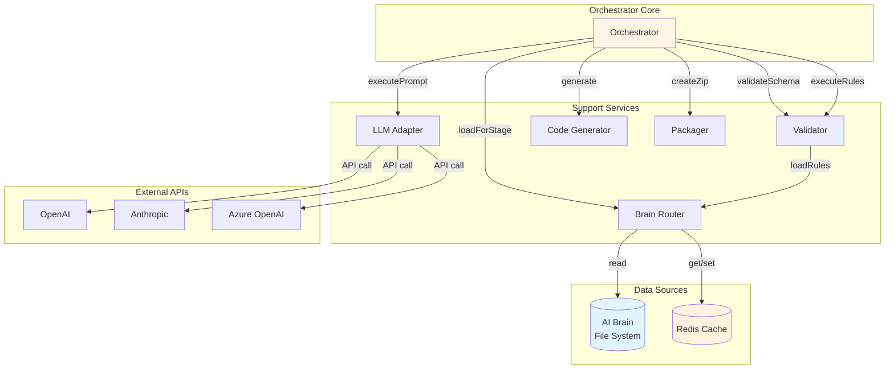
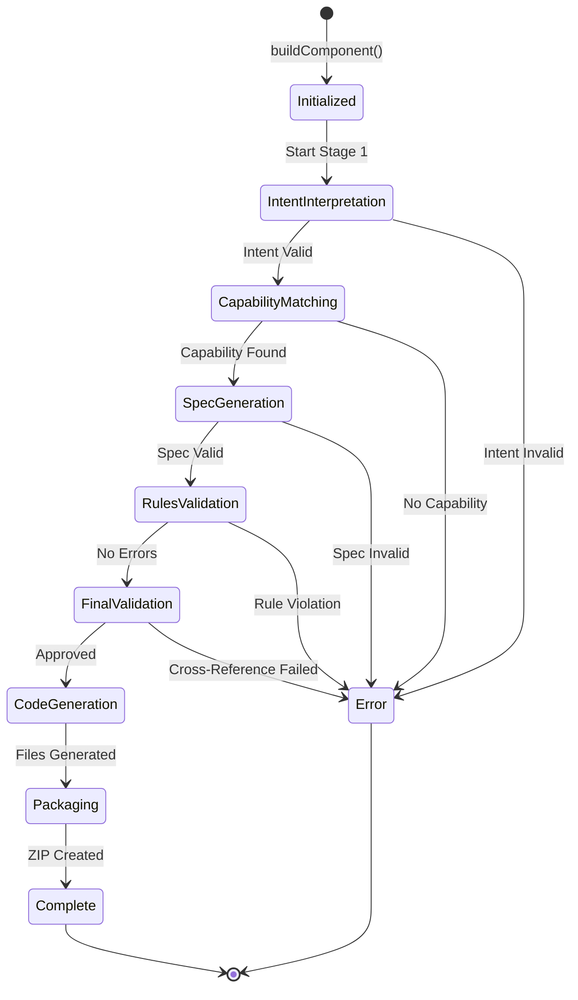
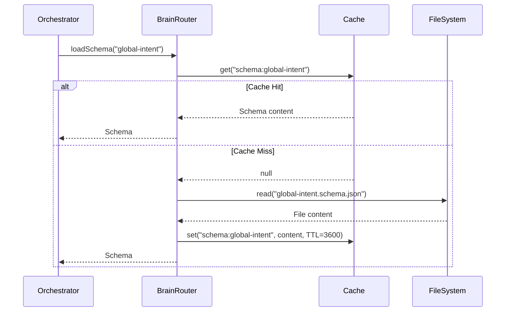
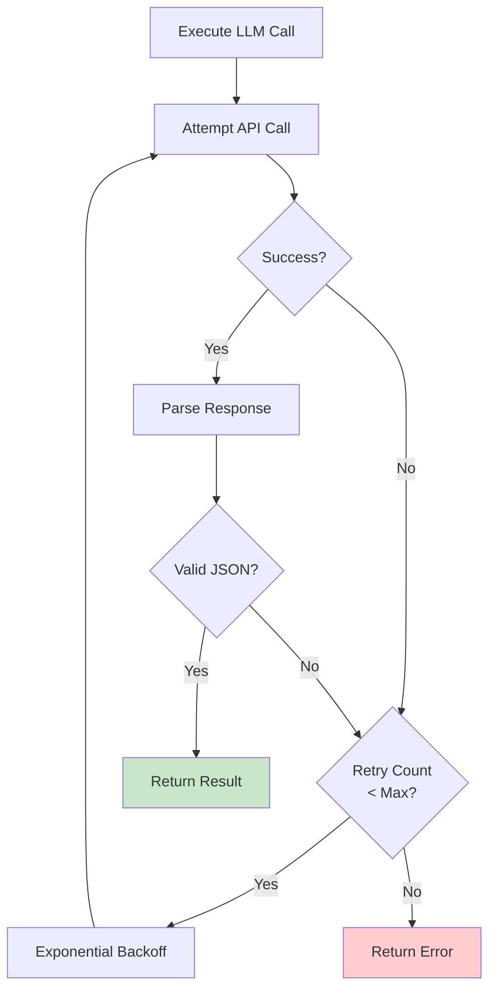
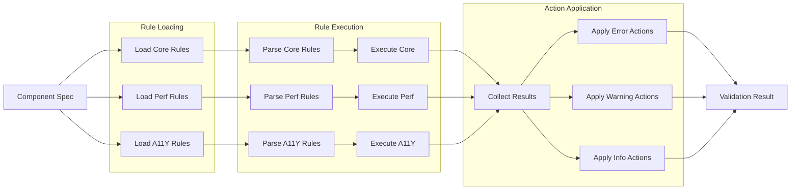
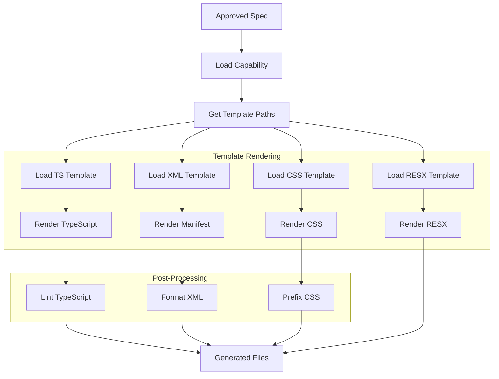
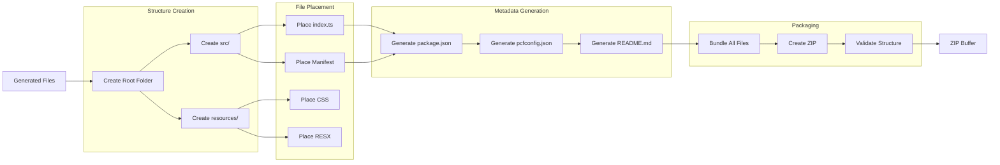
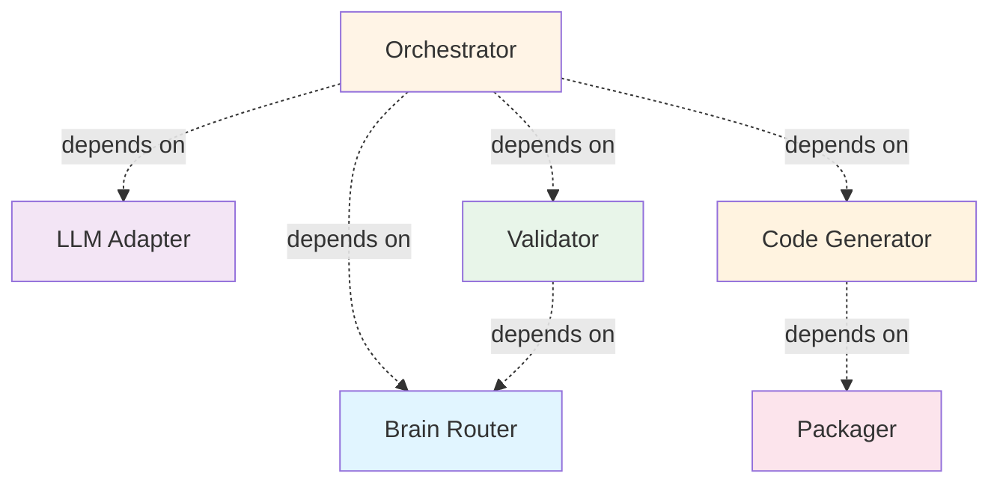
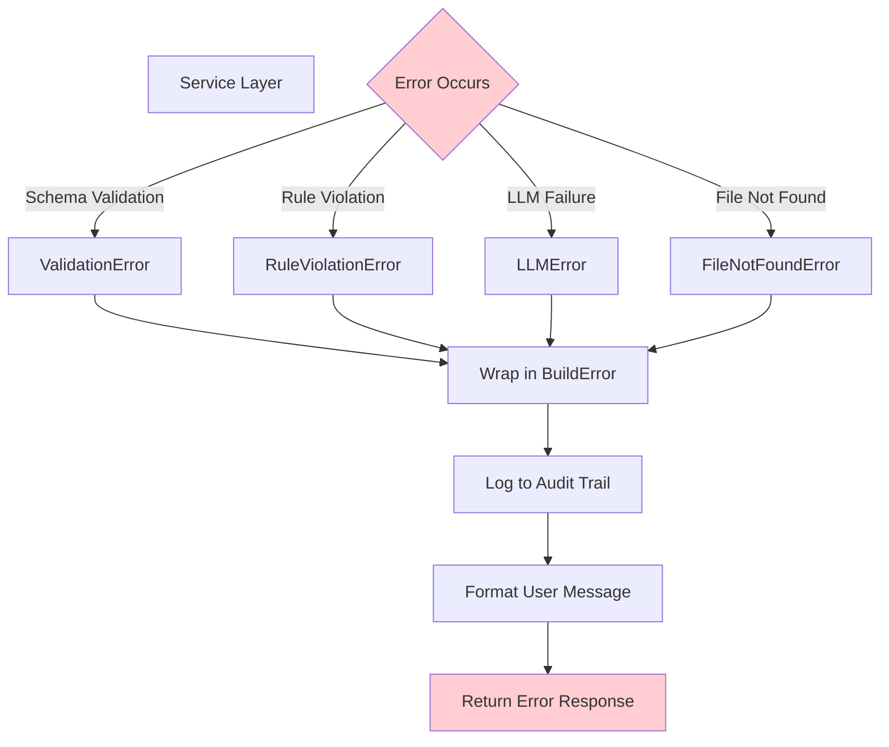

# Component Interaction Diagram

## Service Communication Patterns

## Orchestrator State Machine

## Brain Router Caching Strategy

## LLM Adapter Retry Logic

## Validator Rule Execution Flow

## Code Generator Template Flow

## Packager Assembly Flow

## Inter-Service Dependencies

## Concurrent Operations

```mermaid
gantt
    title Component Build Timeline
    dateFormat  X
    axisFormat %Ls
    
    section Stage 1
    Load Brain Files    :a1, 0, 100ms
    Execute LLM        :a2, after a1, 1500ms
    Validate Schema    :a3, after a2, 50ms
    
    section Stage 2
    Load Capability    :b1, after a3, 50ms
    Match Capability   :b2, after b1, 50ms
    
    section Stage 3
    Load Schema        :c1, after b2, 50ms
    Execute LLM        :c2, after c1, 2000ms
    Validate Schema    :c3, after c2, 50ms
    
    section Stage 4
    Load Rules         :d1, after c3, 100ms
    Execute Rules      :d2, after d1, 400ms
    
    section Stage 5
    Final Validation   :e1, after d2, 100ms
    
    section Generation
    Generate Code      :f1, after e1, 800ms
    Create Package     :f2, after f1, 400ms
```

## Error Propagation

