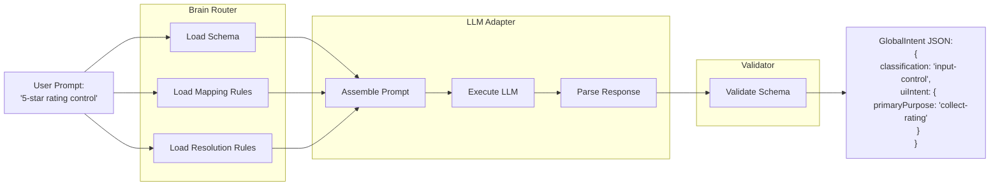
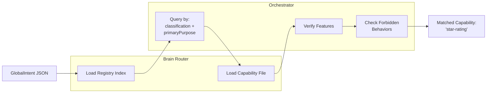
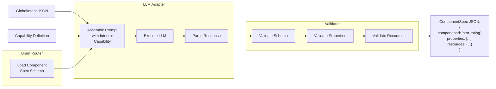
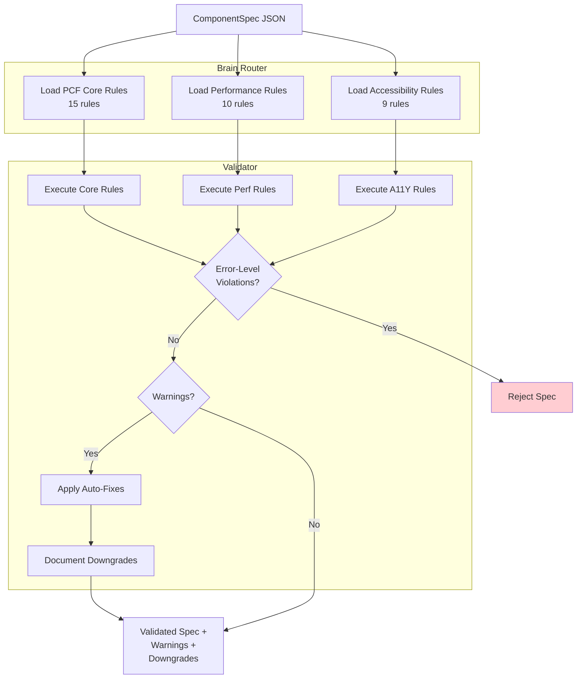
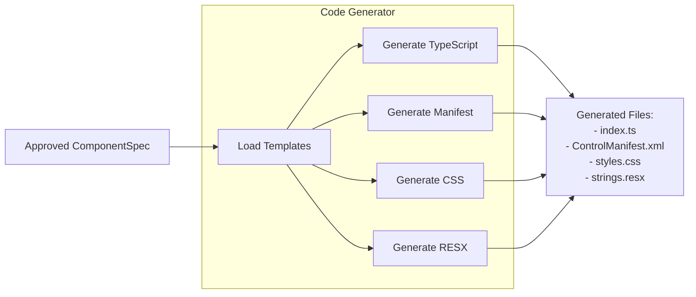
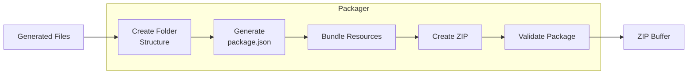
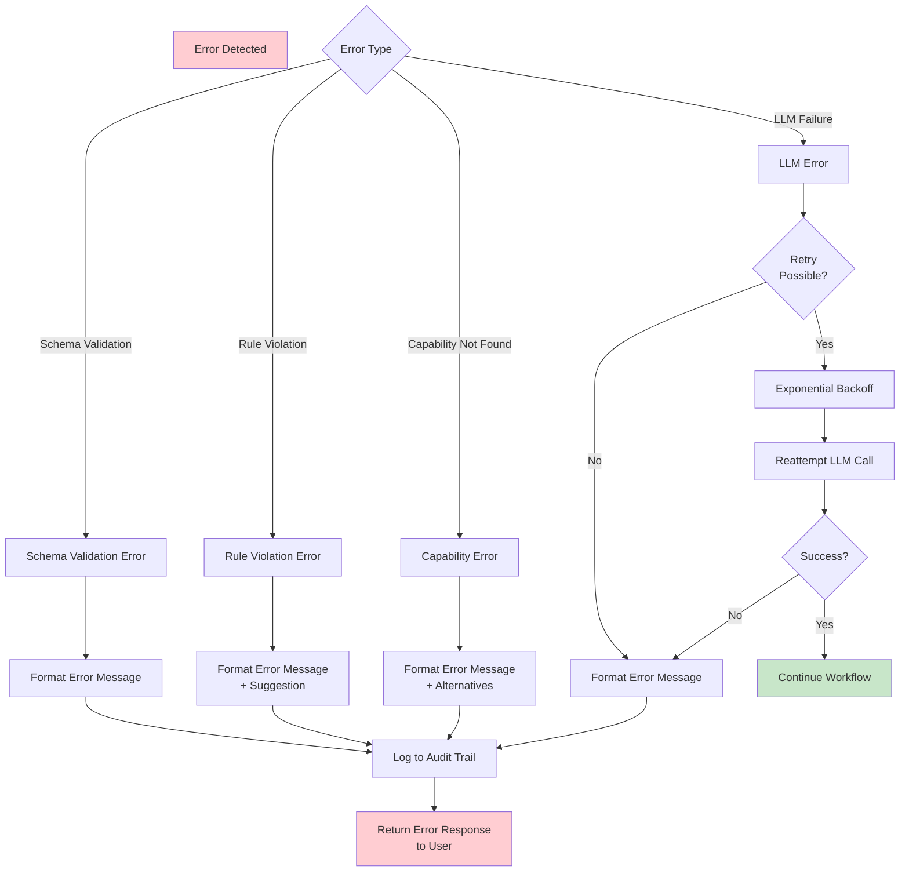

# Data Flow Diagrams

## End-to-End Data Flow

```mermaid
flowchart TD
    START([User Prompt:<br/>"5-star rating control"]) --> INIT[Initialize Build Context]
    
    INIT --> STAGE1[Stage 1: Intent Interpretation]
    
    STAGE1 --> LOAD1[Load: global-intent.schema.json<br/>intent-mapping.rules.json<br/>ambiguity-resolution.rules.json]
    LOAD1 --> LLM1[LLM: Execute Intent Prompt]
    LLM1 --> VAL1{Validate<br/>Schema}
    VAL1 -->|Invalid| ERR1[Return Error]
    VAL1 -->|Valid| INTENT[GlobalIntent JSON]
    
    INTENT --> STAGE2[Stage 2: Capability Matching]
    STAGE2 --> LOAD2[Load: registry.index.json]
    LOAD2 --> QUERY[Query by classification<br/>+ primaryPurpose]
    QUERY --> MATCH{Capability<br/>Found?}
    MATCH -->|No| ERR2[Return Error:<br/>No matching capability]
    MATCH -->|Yes| LOADCAP[Load: star-rating.capability.json]
    LOADCAP --> CHECKCAP{Features<br/>Supported?}
    CHECKCAP -->|No| ERR3[Return Error:<br/>Unsupported feature]
    CHECKCAP -->|Yes| CAP[Capability Matched]
    
    CAP --> STAGE3[Stage 3: Spec Generation]
    STAGE3 --> LOAD3[Load: component-spec.schema.json<br/>capability definition]
    LOAD3 --> LLM2[LLM: Execute Spec Prompt]
    LLM2 --> VAL2{Validate<br/>Schema}
    VAL2 -->|Invalid| ERR4[Return Error]
    VAL2 -->|Valid| SPEC[ComponentSpec JSON]
    
    SPEC --> STAGE4[Stage 4: Rules Validation]
    STAGE4 --> LOAD4[Load: pcf-core.rules.md<br/>pcf-performance.rules.md<br/>pcf-accessibility.rules.md]
    LOAD4 --> EXECRULES[Execute 34 Rules]
    EXECRULES --> CHECKERR{Error-Level<br/>Violations?}
    CHECKERR -->|Yes| ERR5[Return Error:<br/>Rule violation]
    CHECKERR -->|No| CHECKWARN{Warnings?}
    CHECKWARN -->|Yes| DOWNGRADE[Apply Downgrades<br/>Document Warnings]
    CHECKWARN -->|No| VALSPEC[Validated Spec]
    DOWNGRADE --> VALSPEC
    
    VALSPEC --> STAGE5[Stage 5: Final Validation]
    STAGE5 --> CROSS[Cross-Reference<br/>Spec vs Capability]
    CROSS --> CHECKFINAL{Valid?}
    CHECKFINAL -->|No| ERR6[Return Error]
    CHECKFINAL -->|Yes| APPROVED[Approved Spec]
    
    APPROVED --> CODEGEN[Code Generation]
    CODEGEN --> GENFILES[Generate:<br/>index.ts<br/>ControlManifest.xml<br/>styles.css<br/>strings.resx]
    
    GENFILES --> PACKAGE[Packaging]
    PACKAGE --> CREATEZIP[Create ZIP:<br/>Folder structure<br/>package.json<br/>Bundle resources]
    
    CREATEZIP --> OUTPUT([ZIP File Output])
    
    ERR1 --> END([Error Response])
    ERR2 --> END
    ERR3 --> END
    ERR4 --> END
    ERR5 --> END
    ERR6 --> END
    
    style START fill:#e3f2fd
    style OUTPUT fill:#c8e6c9
    style END fill:#ffcdd2
    style INTENT fill:#fff9c4
    style CAP fill:#fff9c4
    style SPEC fill:#fff9c4
    style VALSPEC fill:#fff9c4
    style APPROVED fill:#c8e6c9
```

## Stage 1: Intent Interpretation Data Flow



## Stage 2: Capability Matching Data Flow



## Stage 3: Specification Generation Data Flow



## Stage 4: Rules Validation Data Flow



## Code Generation Data Flow



## Packaging Data Flow



## Error Handling Flow



## Data Transformations Summary

| Stage | Input | Process | Output |
|-------|-------|---------|--------|
| 1 | `string` (user prompt) | Intent interpretation via LLM | `GlobalIntent` JSON |
| 2 | `GlobalIntent` | Capability matching via registry | `capabilityId: string` |
| 3 | `GlobalIntent + Capability` | Spec generation via LLM | `ComponentSpec` JSON |
| 4 | `ComponentSpec` | Rules validation (34 rules) | `ValidatedSpec` JSON |
| 5 | `ValidatedSpec` | Cross-reference validation | `ApprovedSpec` JSON |
| 6 | `ApprovedSpec` | Template-based code generation | `GeneratedFile[]` |
| 7 | `GeneratedFile[]` | ZIP packaging | `Buffer` (ZIP file) |
