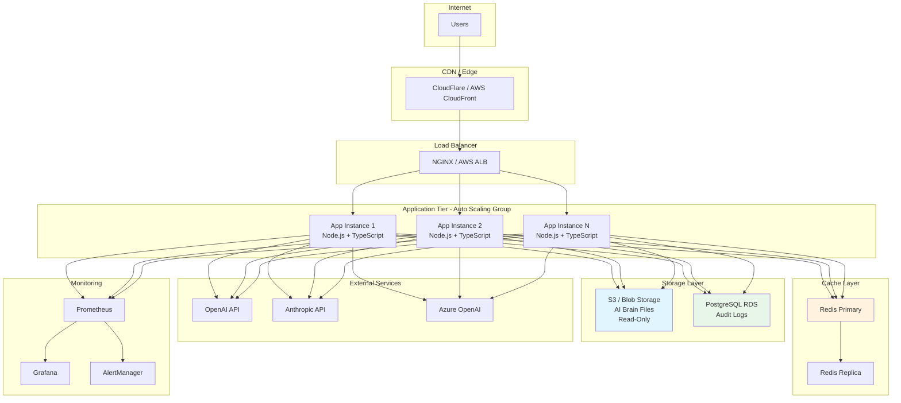
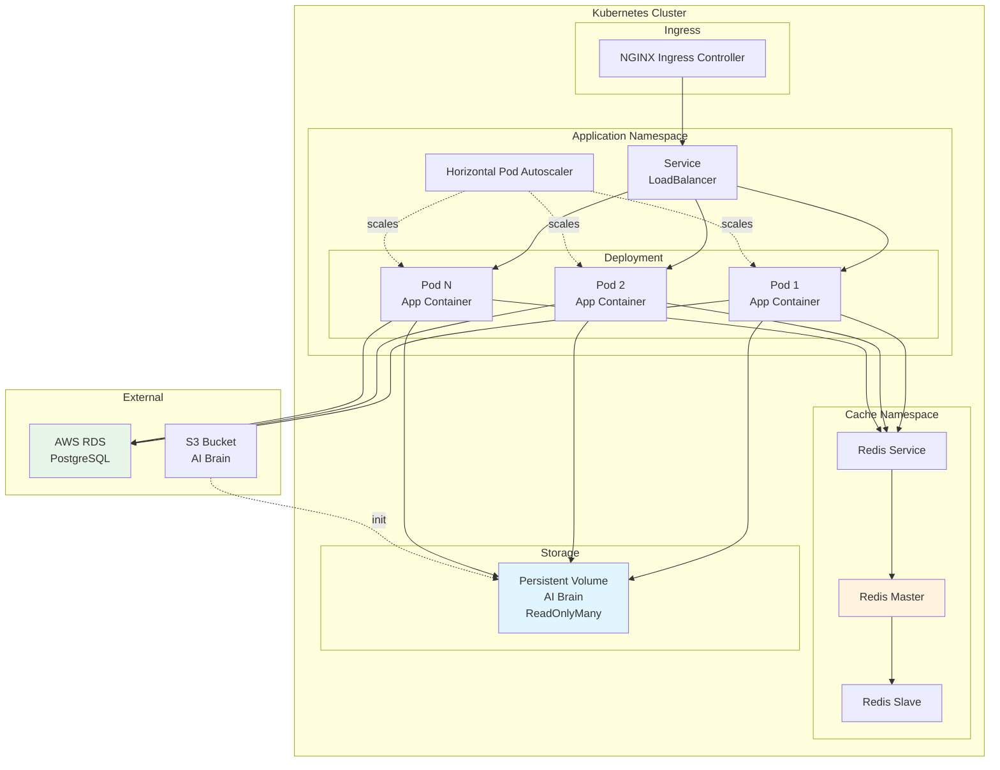
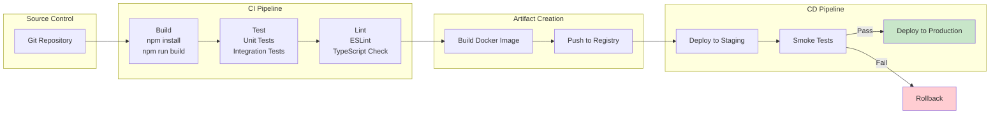
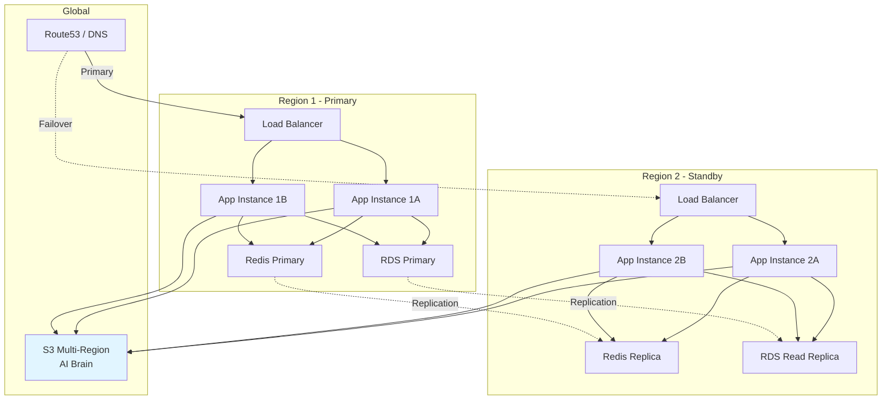
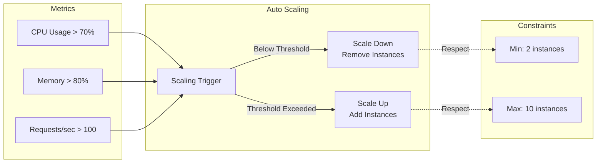
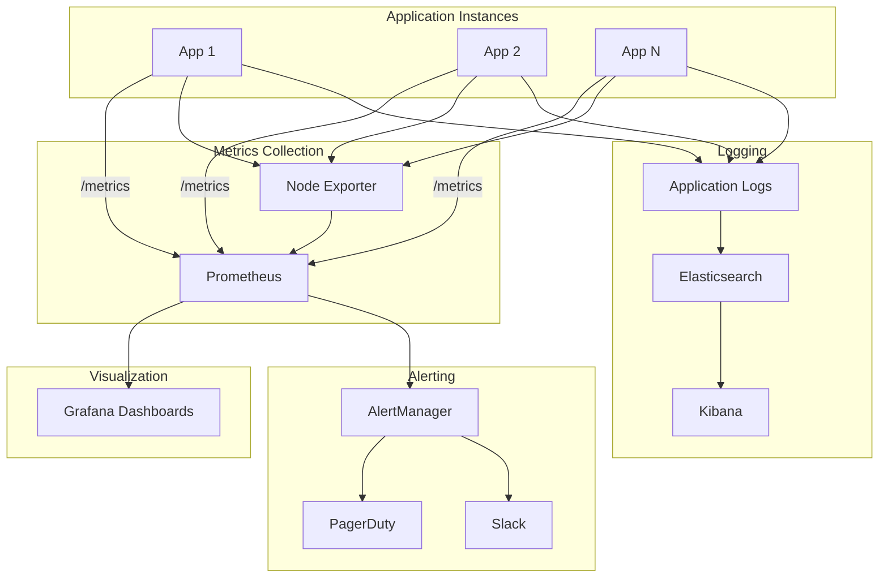
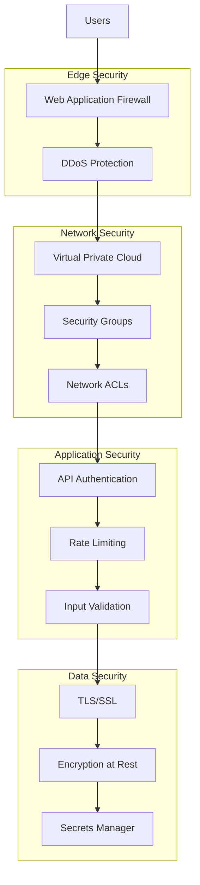
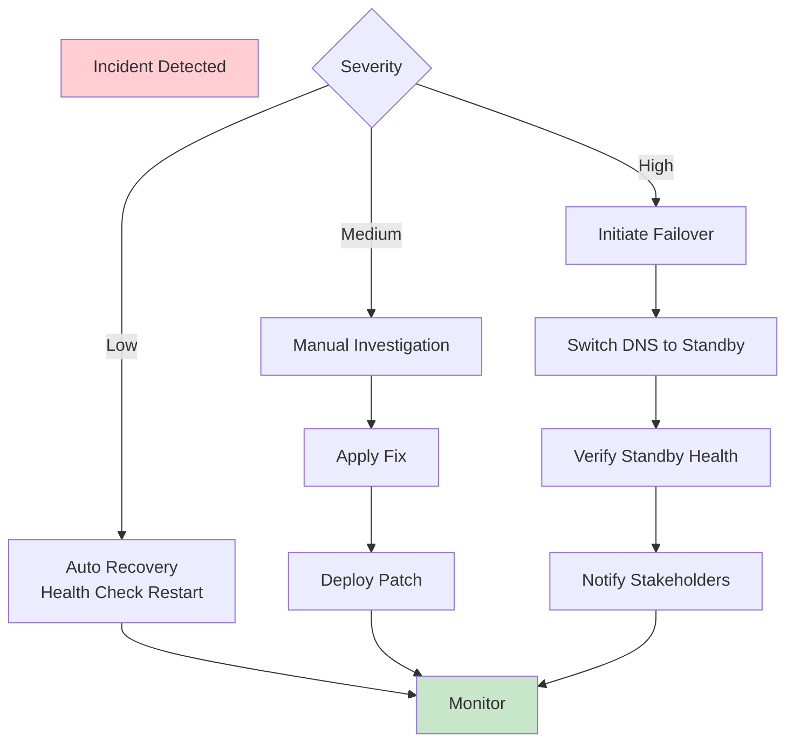

# Deployment Architecture

## Production Deployment



## Container Architecture

```mermaid
graph TB
    subgraph "Docker Container - App Instance"
        subgraph "Application"
            NODE[Node.js Runtime]
            APP[PCF Builder App]
        end
        
        subgraph "Mounted Volumes"
            BRAIN_VOL[/ai-brain<br/>Read-Only Mount]
            TEMP_VOL[/tmp<br/>Temporary Files]
        end
        
        APP --> BRAIN_VOL
        APP --> TEMP_VOL
    end
    
    subgraph "External Storage"
        S3[S3 Bucket<br/>AI Brain Source]
    end
    
    S3 -.->|Sync on Deploy| BRAIN_VOL
    
    style BRAIN_VOL fill:#e1f5ff
```

## Kubernetes Deployment



## CI/CD Pipeline



## High Availability Setup



## Scaling Strategy



## Monitoring Architecture



## Security Architecture



## Deployment Environments

| Environment | Purpose | Instances | Database | Cache | LLM |
|-------------|---------|-----------|----------|-------|-----|
| **Development** | Local development | 1 | SQLite | In-memory | Mock |
| **Staging** | Pre-production testing | 2 | RDS (small) | Redis (small) | Real API (limited) |
| **Production** | Live system | 3-10 (auto-scale) | RDS (multi-AZ) | Redis (cluster) | Real API (full) |

## Infrastructure as Code

```yaml
# Example Kubernetes Deployment
apiVersion: apps/v1
kind: Deployment
metadata:
  name: pcf-builder
spec:
  replicas: 3
  selector:
    matchLabels:
      app: pcf-builder
  template:
    metadata:
      labels:
        app: pcf-builder
    spec:
      containers:
      - name: app
        image: pcf-builder:latest
        ports:
        - containerPort: 3000
        env:
        - name: NODE_ENV
          value: "production"
        volumeMounts:
        - name: ai-brain
          mountPath: /app/ai-brain
          readOnly: true
      volumes:
      - name: ai-brain
        persistentVolumeClaim:
          claimName: ai-brain-pvc
```

## Disaster Recovery


