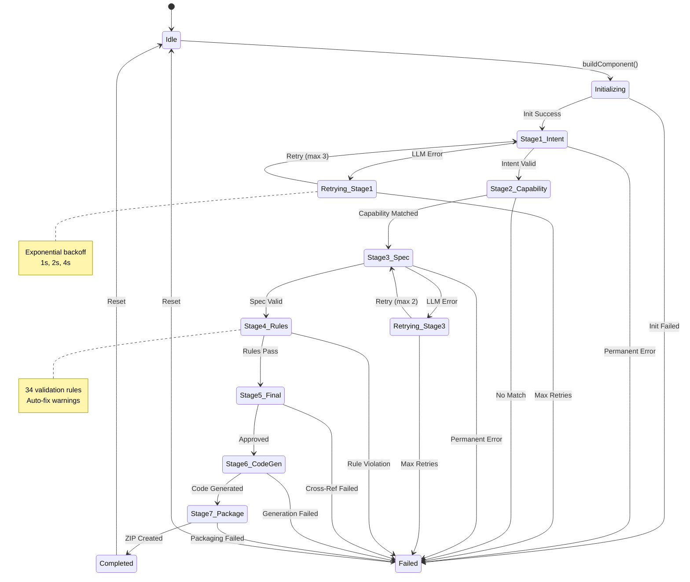
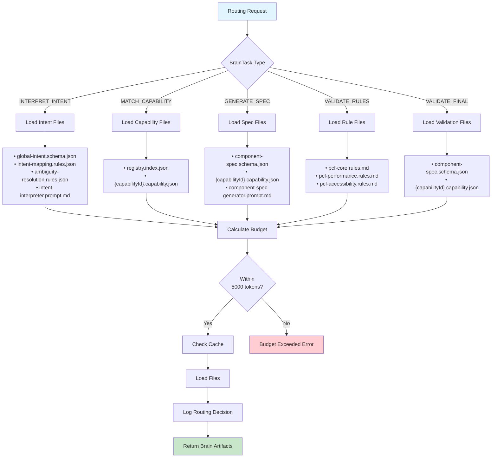
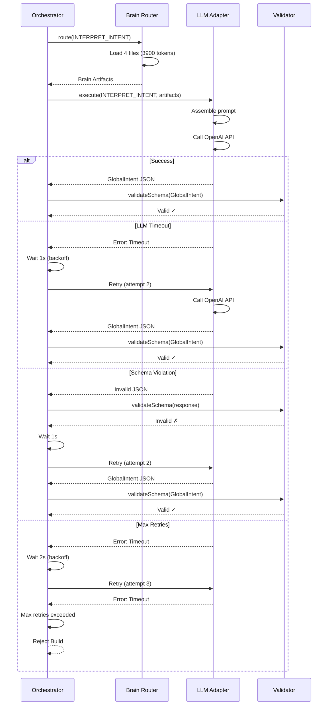
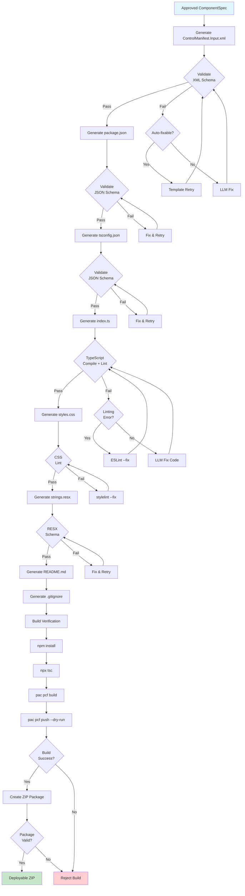
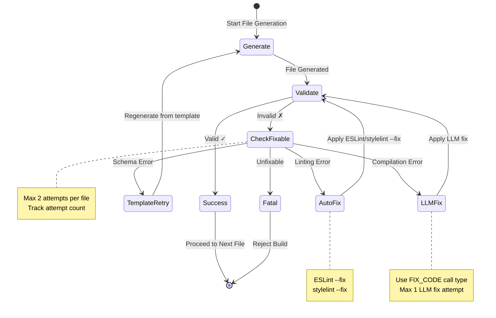
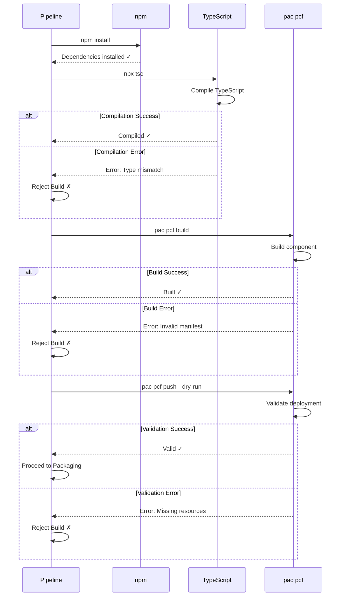
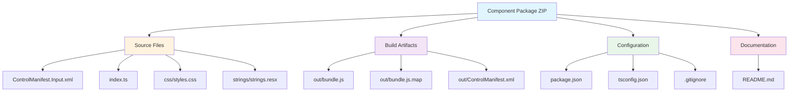

# Architecture Diagrams - Orchestrator & Pipeline

This document contains detailed Mermaid diagrams for the AI Orchestrator and Code Generation Pipeline.

---

## 1. Orchestrator State Machine

---

## 2. Brain Router Task Flow

---

## 3. LLM Call Flow with Retry

---

## 4. Code Generation Pipeline Flow

---

## 5. Validation Checkpoints

```mermaid
graph LR
    subgraph Stage 1: Intent
        I1[User Prompt] --> I2[LLM Call]
        I2 --> I3{Schema<br/>Valid?}
        I3 -->|Yes| I4[GlobalIntent ✓]
        I3 -->|No| I5[Retry/Reject]
    end
    
    subgraph Stage 2: Capability
        C1[GlobalIntent] --> C2[Registry Query]
        C2 --> C3{Capability<br/>Exists?}
        C3 -->|Yes| C4[Capability ✓]
        C3 -->|No| C5[Reject]
    end
    
    subgraph Stage 3: Spec
        S1[Intent + Capability] --> S2[LLM Call]
        S2 --> S3{Schema<br/>Valid?}
        S3 -->|Yes| S4[ComponentSpec ✓]
        S3 -->|No| S5[Retry/Reject]
    end
    
    subgraph Stage 4: Rules
        R1[ComponentSpec] --> R2[Execute 34 Rules]
        R2 --> R3{All Rules<br/>Pass?}
        R3 -->|Yes| R4[Validated Spec ✓]
        R3 -->|Warnings| R6[Auto-fix]
        R3 -->|Errors| R5[Reject]
        R6 --> R4
    end
    
    subgraph Stage 5: Final
        F1[Validated Spec] --> F2[Cross-Reference]
        F2 --> F3{Capability<br/>Bounds?}
        F3 -->|Yes| F4[Approved Spec ✓]
        F3 -->|No| F5[Reject]
    end
    
    I4 --> C1
    C4 --> S1
    S4 --> R1
    R4 --> F1
    
    style I4 fill:#c8e6c9
    style C4 fill:#c8e6c9
    style S4 fill:#c8e6c9
    style R4 fill:#c8e6c9
    style F4 fill:#c8e6c9
    style I5 fill:#ffcdd2
    style C5 fill:#ffcdd2
    style S5 fill:#ffcdd2
    style R5 fill:#ffcdd2
    style F5 fill:#ffcdd2
```

---

## 6. Error-Fix Loop Detail

---

## 7. Build Verification Steps

---

## 8. Package Structure

---

## 9. Complete System Data Flow

```mermaid
flowchart TD
    USER[User Prompt] --> ORCH[Orchestrator]
    
    ORCH --> S1[Stage 1: Intent]
    S1 --> BR1[Brain Router: INTERPRET_INTENT]
    BR1 --> LLM1[LLM: Convert to JSON]
    LLM1 --> VAL1[Validator: Schema Check]
    VAL1 --> INTENT[GlobalIntent ✓]
    
    INTENT --> S2[Stage 2: Capability]
    S2 --> BR2[Brain Router: MATCH_CAPABILITY]
    BR2 --> MATCH[Registry Query]
    MATCH --> CAP[Capability ✓]
    
    CAP --> S3[Stage 3: Spec]
    S3 --> BR3[Brain Router: GENERATE_SPEC]
    BR3 --> LLM2[LLM: Generate Spec]
    LLM2 --> VAL2[Validator: Schema Check]
    VAL2 --> SPEC[ComponentSpec ✓]
    
    SPEC --> S4[Stage 4: Rules]
    S4 --> BR4[Brain Router: VALIDATE_RULES]
    BR4 --> VAL3[Validator: 34 Rules]
    VAL3 --> VSPEC[Validated Spec ✓]
    
    VSPEC --> S5[Stage 5: Final]
    S5 --> BR5[Brain Router: VALIDATE_FINAL]
    BR5 --> VAL4[Validator: Cross-Reference]
    VAL4 --> ASPEC[Approved Spec ✓]
    
    ASPEC --> S6[Stage 6: Code Gen]
    S6 --> GEN[Code Generator]
    GEN --> FILES[8 Generated Files]
    FILES --> LINT[Linting & Validation]
    LINT --> CODE[Source Code ✓]
    
    CODE --> S7[Stage 7: Package]
    S7 --> BUILD[Build Verification]
    BUILD --> PKG[Packager]
    PKG --> ZIP[Deployable ZIP ✓]
    
    ZIP --> USER_RESULT[User Download]
    
    style USER fill:#e1f5ff
    style USER_RESULT fill:#c8e6c9
    style INTENT fill:#fff3e0
    style CAP fill:#fff3e0
    style SPEC fill:#fff3e0
    style VSPEC fill:#fff3e0
    style ASPEC fill:#fff3e0
    style CODE fill:#f3e5f5
    style ZIP fill:#c8e6c9
```

---

## Summary

These diagrams illustrate:

1. **Orchestrator State Machine** - Complete state transitions with retry logic
2. **Brain Router Task Flow** - File loading and budget calculation
3. **LLM Call Flow** - Retry strategy with exponential backoff
4. **Code Generation Pipeline** - 8-step file generation with validation
5. **Validation Checkpoints** - 5 validation stages across the pipeline
6. **Error-Fix Loop** - Auto-fix, template retry, and LLM fix strategies
7. **Build Verification** - 4-step verification process
8. **Package Structure** - ZIP contents and organization
9. **Complete System Data Flow** - End-to-end from user prompt to ZIP

All diagrams use Mermaid for easy rendering and modification.
