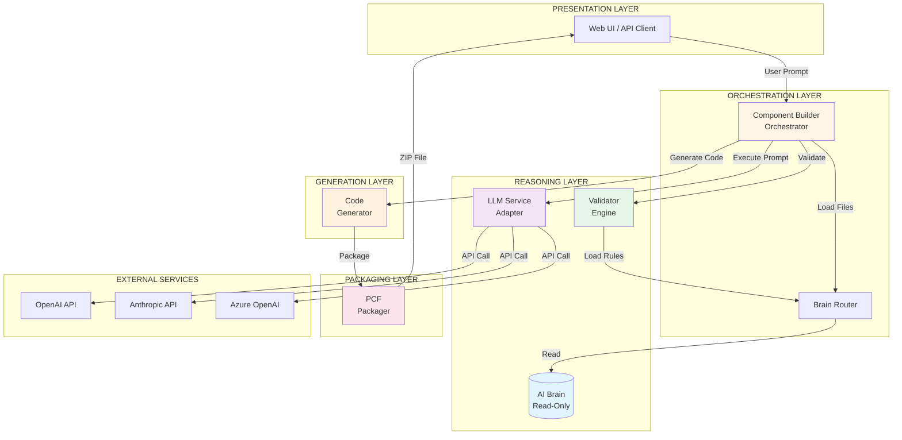
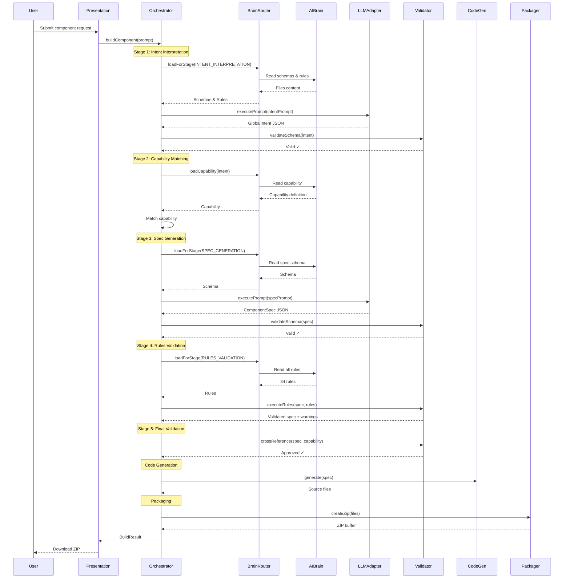
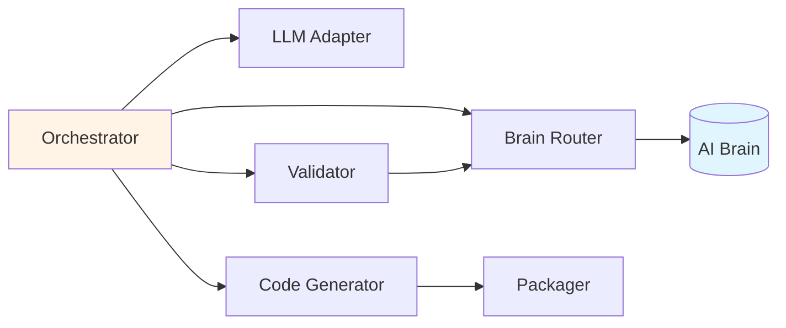
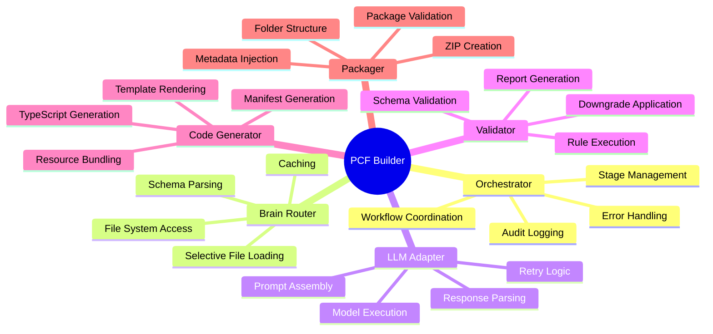
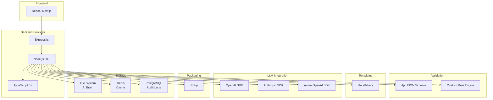
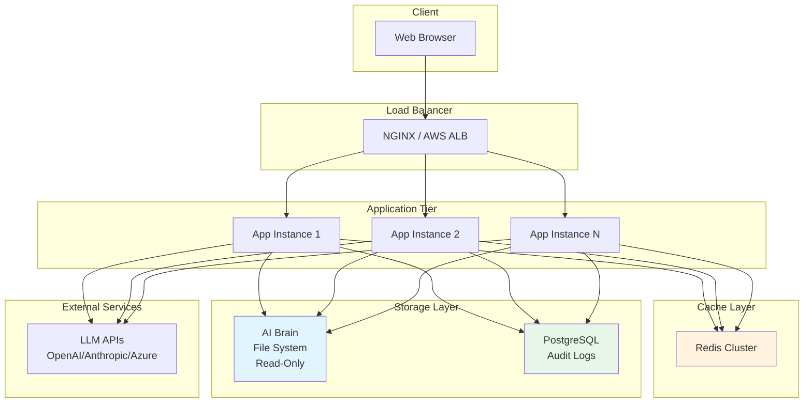

# System Architecture Diagram

## Overall System Architecture

## Layer Interaction Flow

## Service Dependencies

## Component Responsibilities

## Technology Stack

## Deployment Architecture

## Key Characteristics

### Stateless Design
- Orchestrator instances are stateless
- Horizontal scaling supported
- No session affinity required

### Read-Only AI Brain
- Mounted as read-only file system
- Shared across all instances
- Versioned deployments

### Caching Strategy
- Brain artifacts cached in Redis
- TTL-based invalidation
- Reduces file I/O

### High Availability
- Multiple app instances
- Load balancer health checks
- Graceful degradation on LLM failures
