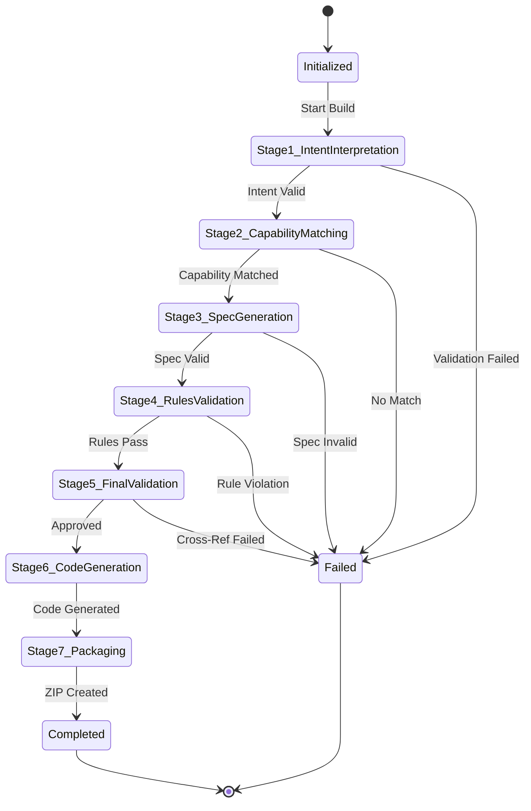
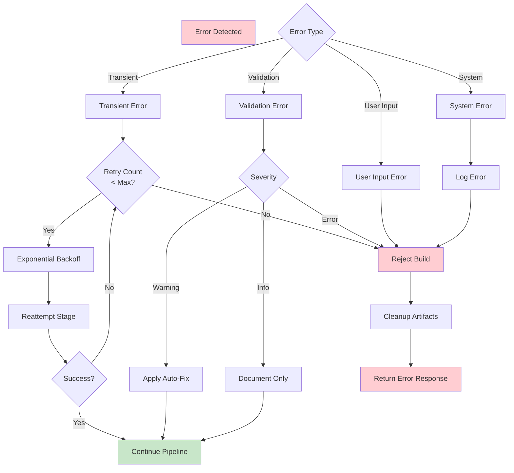
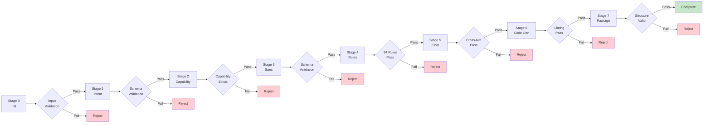
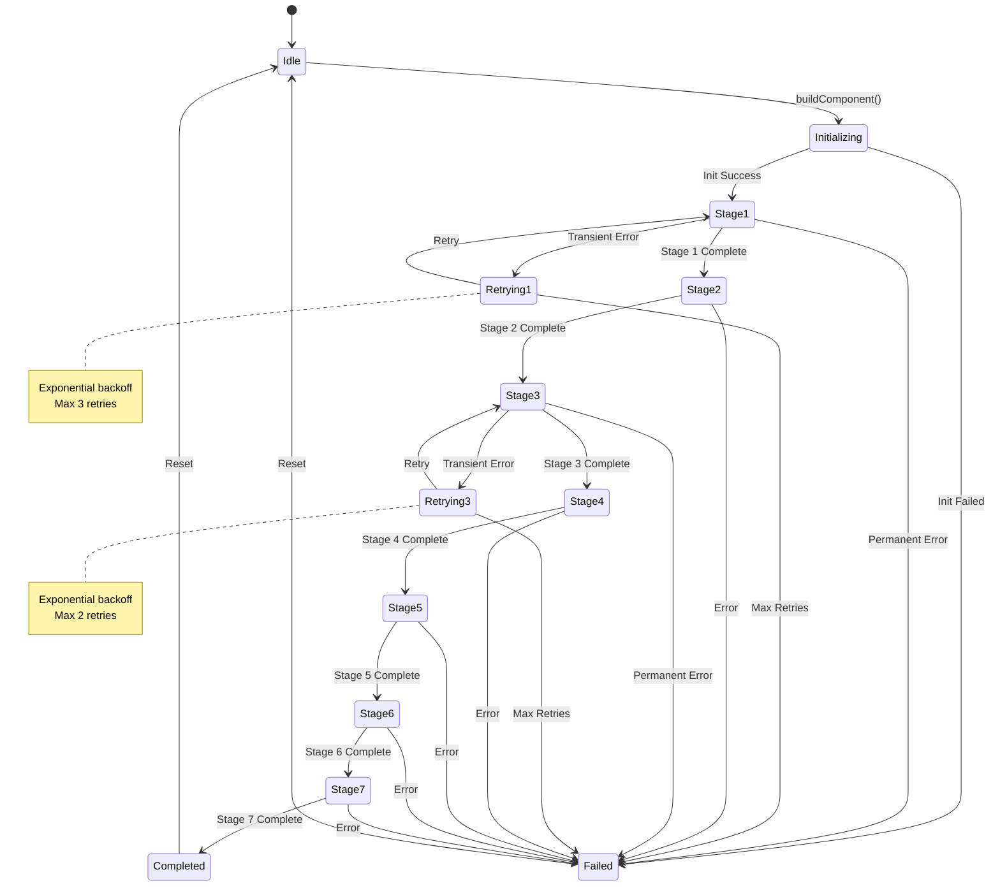

# AI Orchestrator Architecture Specification

## Executive Summary

The AI Orchestrator is the central coordinator for the PCF Component Builder. It executes a deterministic, idempotent 7-stage pipeline, persisting intermediate artifacts and supporting step-level retry. The orchestrator is stateless at the service level but maintains build state in persistent storage.

**Core Principles**:
- **Deterministic**: Same input → Same output
- **Idempotent**: Re-running a stage produces the same result
- **Resumable**: Can resume from any stage using persisted artifacts
- **Auditable**: Complete trail of all decisions and actions

---

## 1. Orchestrator Responsibilities

### Primary Responsibilities

#### 1.1 Workflow Coordination
- Execute the 7-stage pipeline in sequence
- Manage state transitions between stages
- Coordinate service calls (Brain Router, LLM Adapter, Validator, Code Generator, Packager)
- Ensure each stage completes successfully before proceeding

#### 1.2 State Management
- Persist intermediate artifacts after each stage
- Load previous state for retry/resume operations
- Maintain build context throughout execution
- Track stage completion status

#### 1.3 Validation Orchestration
- Trigger validation at appropriate checkpoints
- Collect validation results (errors, warnings, downgrades)
- Decide whether to proceed, downgrade, or reject
- Apply auto-fixes when applicable

#### 1.4 Error Handling
- Catch and classify errors at each stage
- Execute retry logic for transient failures
- Perform rollback on unrecoverable errors
- Generate user-friendly error messages

#### 1.5 Audit Logging
- Log all stage executions with timestamps
- Record all service calls and responses
- Track validation results and decisions
- Maintain complete audit trail for debugging

#### 1.6 Resource Management
- Manage LLM API calls (rate limiting, quotas)
- Control concurrent builds
- Clean up temporary artifacts
- Monitor execution time and timeouts

### Non-Responsibilities (Delegated to Other Services)

❌ **NOT** responsible for:
- Loading AI Brain files (delegated to Brain Router)
- Executing LLM calls (delegated to LLM Adapter)
- Schema/rule validation (delegated to Validator)
- Code generation (delegated to Code Generator)
- ZIP packaging (delegated to Packager)
- Business logic (defined in AI Brain)

---

## 2. Execution Pipeline (7 Stages)



### Stage Overview

| Stage | Name | LLM Call | Validation | Persisted Artifact |
|-------|------|----------|------------|-------------------|
| 0 | Initialization | No | Input validation | `build-context.json` |
| 1 | Intent Interpretation | Yes | Schema validation | `global-intent.json` |
| 2 | Capability Matching | No | Capability exists | `capability-match.json` |
| 3 | Spec Generation | Yes | Schema validation | `component-spec.json` |
| 4 | Rules Validation | No | 34 rules | `validated-spec.json` |
| 5 | Final Validation | No | Cross-reference | `approved-spec.json` |
| 6 | Code Generation | No | Linting | `generated-files.json` |
| 7 | Packaging | No | Structure validation | `package.zip` |

---

## 3. Stage Inputs and Outputs

### Stage 0: Initialization

**Purpose**: Validate input and create build context

**Inputs**:
```typescript
{
  userPrompt: string;          // Natural language description
  config: BuilderConfig;       // Builder configuration
  buildId?: string;            // Optional: for resume
}
```

**Process**:
1. Generate or load `buildId`
2. Validate `userPrompt` (not empty, length < 5000 chars)
3. Validate `config` (required fields present)
4. Create build directory: `builds/{buildId}/`
5. Initialize audit log

**Outputs**:
```typescript
{
  buildId: string;
  buildContext: BuildContext;
  status: 'initialized';
}
```

**Persisted Artifact**: `builds/{buildId}/build-context.json`
```json
{
  "buildId": "uuid",
  "userPrompt": "5-star rating control",
  "config": {...},
  "createdAt": "2026-02-06T15:21:17Z",
  "currentStage": 0,
  "status": "initialized"
}
```

**Validation**: Input validation only  
**Failure Action**: Reject with error message

---

### Stage 1: Intent Interpretation

**Purpose**: Convert natural language to structured GlobalIntent

**Inputs**:
```typescript
{
  buildContext: BuildContext;
  userPrompt: string;
}
```

**Process**:
1. Load brain artifacts via Brain Router:
   - `global-intent.schema.json`
   - `intent-mapping.rules.json`
   - `ambiguity-resolution.rules.json`
   - `intent-interpreter.prompt.md`
2. Assemble prompt with context
3. Call LLM Adapter to execute prompt
4. Parse LLM response to JSON
5. Validate against `global-intent.schema.json`
6. Check for ambiguities using resolution rules
7. Persist result

**Outputs**:
```typescript
{
  globalIntent: GlobalIntent;
  validationResult: SchemaValidationResult;
  llmMetadata: ExecutionMetadata;
}
```

**Persisted Artifact**: `builds/{buildId}/stage-1-intent.json`
```json
{
  "stage": 1,
  "completedAt": "2026-02-06T15:21:20Z",
  "globalIntent": {
    "classification": "input-control",
    "uiIntent": {
      "primaryPurpose": "collect-rating",
      "visualStyle": "standard",
      "dataBinding": "single-value"
    },
    "interaction": {
      "inputMethod": ["click", "tap"],
      "feedback": ["visual-highlight"]
    }
  },
  "validationResult": {
    "valid": true,
    "errors": []
  },
  "llmMetadata": {
    "model": "gpt-4",
    "tokensUsed": 450,
    "duration": 1200
  }
}
```

**Validation**:
- Schema validation against `global-intent.schema.json`
- Ambiguity check using resolution rules

**Failure Actions**:
- Schema validation failed → Retry (max 2 times) → Reject
- LLM call failed → Retry with backoff (max 3 times) → Reject
- Ambiguity unresolvable → Reject with clarification request

---

### Stage 2: Capability Matching

**Purpose**: Match GlobalIntent to a specific component capability

**Inputs**:
```typescript
{
  buildContext: BuildContext;
  globalIntent: GlobalIntent;
}
```

**Process**:
1. Load `registry.index.json` via Brain Router
2. Query registry by:
   - `classification` (e.g., "input-control")
   - `primaryPurpose` (e.g., "collect-rating")
3. If multiple matches, apply disambiguation rules
4. Load matched capability file (e.g., `star-rating.capability.json`)
5. Verify requested features are supported
6. Check for forbidden behaviors
7. Persist result

**Outputs**:
```typescript
{
  capabilityId: string;
  capability: Capability;
  matchConfidence: number;
}
```

**Persisted Artifact**: `builds/{buildId}/stage-2-capability.json`
```json
{
  "stage": 2,
  "completedAt": "2026-02-06T15:21:21Z",
  "capabilityId": "star-rating",
  "capability": {
    "capabilityId": "star-rating",
    "componentType": "Star Rating Input",
    "supportedFeatures": [...],
    "limits": {...},
    "forbidden": [...]
  },
  "matchConfidence": 0.95
}
```

**Validation**:
- Capability exists in registry
- Requested features are in `supportedFeatures`
- No forbidden behaviors requested

**Failure Actions**:
- No capability found → Reject with available alternatives
- Unsupported feature → Reject with supported features list
- Forbidden behavior → Reject with alternative suggestion

---

### Stage 3: Specification Generation

**Purpose**: Generate ComponentSpec from GlobalIntent and Capability

**Inputs**:
```typescript
{
  buildContext: BuildContext;
  globalIntent: GlobalIntent;
  capability: Capability;
}
```

**Process**:
1. Load brain artifacts via Brain Router:
   - `component-spec.schema.json`
   - `component-spec-generator.prompt.md`
2. Assemble prompt with intent + capability
3. Call LLM Adapter to execute prompt
4. Parse LLM response to JSON
5. Validate against `component-spec.schema.json`
6. Verify property data types are valid PCF types
7. Check resource paths are valid
8. Persist result

**Outputs**:
```typescript
{
  componentSpec: ComponentSpec;
  validationResult: SchemaValidationResult;
  llmMetadata: ExecutionMetadata;
}
```

**Persisted Artifact**: `builds/{buildId}/stage-3-spec.json`
```json
{
  "stage": 3,
  "completedAt": "2026-02-06T15:21:24Z",
  "componentSpec": {
    "componentId": "star-rating",
    "componentName": "StarRating",
    "namespace": "CustomControls",
    "displayName": "Star Rating",
    "description": "A 5-star rating input control",
    "capabilities": {
      "capabilityId": "star-rating",
      "features": ["star-display", "click-input", "keyboard-nav"],
      "customizations": {
        "maxStars": 5,
        "allowHalfStars": false
      }
    },
    "properties": [
      {
        "name": "rating",
        "displayName": "Rating",
        "dataType": "Whole.None",
        "usage": "bound",
        "required": true
      }
    ],
    "resources": {
      "code": "index.ts",
      "css": ["styles.css"],
      "resx": ["strings.resx"]
    }
  },
  "validationResult": {
    "valid": true,
    "errors": []
  },
  "llmMetadata": {
    "model": "gpt-4",
    "tokensUsed": 680,
    "duration": 2100
  }
}
```

**Validation**:
- Schema validation against `component-spec.schema.json`
- Property data types are valid PCF types
- At least one bound property exists

**Failure Actions**:
- Schema validation failed → Retry (max 2 times) → Reject
- Invalid data type → Auto-fix to closest valid type → Warn
- No bound property → Reject with explanation

---

### Stage 4: Rules Validation

**Purpose**: Execute 34 validation rules against ComponentSpec

**Inputs**:
```typescript
{
  buildContext: BuildContext;
  componentSpec: ComponentSpec;
  capability: Capability;
}
```

**Process**:
1. Load all rule files via Brain Router:
   - `pcf-core.rules.md` (15 rules)
   - `pcf-performance.rules.md` (10 rules)
   - `pcf-accessibility.rules.md` (9 rules)
2. Parse rules into executable format
3. Execute each rule against spec
4. Collect results by severity:
   - **error**: Violations that must be fixed
   - **warning**: Issues that can be auto-fixed or downgraded
   - **info**: Informational notes
5. Apply auto-fixes for warnings
6. Document downgrades
7. Persist result

**Outputs**:
```typescript
{
  validatedSpec: ComponentSpec;
  ruleValidationResult: RuleValidationResult;
  errors: BuildError[];
  warnings: string[];
  downgrades: Downgrade[];
}
```

**Persisted Artifact**: `builds/{buildId}/stage-4-validated.json`
```json
{
  "stage": 4,
  "completedAt": "2026-02-06T15:21:25Z",
  "validatedSpec": {...},
  "ruleValidationResult": {
    "valid": true,
    "errors": [],
    "warnings": [
      "PCF_PERF_002: Component has more than 5 properties. Consider grouping."
    ],
    "downgrades": [],
    "rulesExecuted": 34
  }
}
```

**Validation**:
- All 34 rules executed
- No error-level violations

**Failure Actions**:
- Error-level violation → Reject with rule message and suggestion
- Warning-level violation → Apply auto-fix or downgrade → Continue
- Info-level → Document only → Continue

---

### Stage 5: Final Validation

**Purpose**: Cross-reference spec with capability constraints

**Inputs**:
```typescript
{
  buildContext: BuildContext;
  validatedSpec: ComponentSpec;
  capability: Capability;
}
```

**Process**:
1. Verify all features in spec are in capability's `supportedFeatures`
2. Check all customizations respect capability `limits`
3. Ensure no forbidden behaviors are present
4. Verify all downgrades were applied correctly
5. Confirm spec is production-ready
6. Persist result

**Outputs**:
```typescript
{
  approvedSpec: ComponentSpec;
  finalValidationResult: ValidationResult;
}
```

**Persisted Artifact**: `builds/{buildId}/stage-5-approved.json`
```json
{
  "stage": 5,
  "completedAt": "2026-02-06T15:21:26Z",
  "approvedSpec": {...},
  "finalValidationResult": {
    "valid": true,
    "errors": [],
    "warnings": [],
    "downgrades": []
  }
}
```

**Validation**:
- Spec matches capability constraints
- All limits respected
- No forbidden behaviors

**Failure Actions**:
- Constraint violation → Reject with explanation
- Limit exceeded → Reject (should have been caught in Stage 4)

---

### Stage 6: Code Generation

**Purpose**: Generate PCF source files from approved spec

**Inputs**:
```typescript
{
  buildContext: BuildContext;
  approvedSpec: ComponentSpec;
  capability: Capability;
}
```

**Process**:
1. Call Code Generator service
2. Generate TypeScript implementation
3. Generate ControlManifest.Input.xml
4. Generate CSS styles
5. Generate RESX localization files
6. Lint generated TypeScript
7. Validate generated manifest
8. Persist all files

**Outputs**:
```typescript
{
  generatedFiles: GeneratedFile[];
  generationMetadata: GenerationMetadata;
}
```

**Persisted Artifact**: `builds/{buildId}/stage-6-generated.json`
```json
{
  "stage": 6,
  "completedAt": "2026-02-06T15:21:27Z",
  "generatedFiles": [
    {
      "path": "index.ts",
      "content": "...",
      "type": "typescript"
    },
    {
      "path": "ControlManifest.Input.xml",
      "content": "...",
      "type": "xml"
    },
    {
      "path": "styles.css",
      "content": "...",
      "type": "css"
    },
    {
      "path": "strings.resx",
      "content": "...",
      "type": "resx"
    }
  ],
  "generationMetadata": {
    "templateVersion": "1.0.0",
    "generatedAt": "2026-02-06T15:21:27Z",
    "filesGenerated": 4
  }
}
```

**Validation**:
- TypeScript passes linting
- Manifest is valid XML
- All required files generated

**Failure Actions**:
- Linting failed → Fix template → Retry
- Template error → Internal error → Contact support

---

### Stage 7: Packaging

**Purpose**: Create ZIP package for deployment

**Inputs**:
```typescript
{
  buildContext: BuildContext;
  generatedFiles: GeneratedFile[];
  approvedSpec: ComponentSpec;
}
```

**Process**:
1. Call Packager service
2. Create PCF folder structure
3. Generate package.json
4. Generate pcfconfig.json
5. Generate README.md
6. Bundle all resources
7. Create ZIP file
8. Validate package structure
9. Persist ZIP

**Outputs**:
```typescript
{
  zipBuffer: Buffer;
  packageManifest: PackageManifest;
}
```

**Persisted Artifact**: `builds/{buildId}/package.zip`

**Validation**:
- Package structure matches PCF requirements
- All files present
- ZIP is valid

**Failure Actions**:
- Structure invalid → Internal error → Contact support
- ZIP creation failed → Retry → Contact support

---

## 4. Failure Handling Strategy

### Error Classification



### Retry Strategy

| Error Type | Max Retries | Backoff | Stages |
|------------|-------------|---------|--------|
| LLM API timeout | 3 | Exponential (1s, 2s, 4s) | 1, 3 |
| LLM invalid response | 2 | Linear (1s, 1s) | 1, 3 |
| Network error | 3 | Exponential (1s, 2s, 4s) | All |
| Validation error | 0 | None | All |
| System error | 1 | None | All |

### Rollback Mechanism

When a stage fails after retries:

1. **Mark build as failed** in `build-context.json`
2. **Preserve all artifacts** for debugging
3. **Log failure** to audit trail
4. **Clean up temporary files** (not persisted artifacts)
5. **Return error response** with:
   - Error code
   - User-friendly message
   - Suggestion for resolution
   - Alternatives (if applicable)

### Resume Capability

The orchestrator supports resuming from any stage:

```typescript
// Resume from Stage 3
orchestrator.resumeBuild(buildId, {
  resumeFromStage: 3,
  overrideInputs: {
    // Optional: override inputs for retry
  }
});
```

**Resume Process**:
1. Load `build-context.json`
2. Load persisted artifact from previous stage
3. Resume execution from specified stage
4. Continue pipeline normally

---

## 5. Validation Checkpoints



### Validation Summary

| Stage | Validation Type | Validator | Failure Action |
|-------|----------------|-----------|----------------|
| 0 | Input validation | Orchestrator | Reject |
| 1 | Schema validation | Validator | Retry → Reject |
| 2 | Capability exists | Orchestrator | Reject with alternatives |
| 3 | Schema validation | Validator | Retry → Reject |
| 4 | 34 rules | Validator | Auto-fix/Downgrade or Reject |
| 5 | Cross-reference | Validator | Reject |
| 6 | Linting | Code Generator | Fix template → Retry |
| 7 | Structure validation | Packager | Retry → Reject |

---

## 6. State Persistence

### Build Directory Structure

```
builds/
└── {buildId}/
    ├── build-context.json          # Build metadata
    ├── stage-1-intent.json         # GlobalIntent
    ├── stage-2-capability.json     # Capability match
    ├── stage-3-spec.json           # ComponentSpec
    ├── stage-4-validated.json      # Validated spec
    ├── stage-5-approved.json       # Approved spec
    ├── stage-6-generated.json      # Generated files metadata
    ├── generated/                  # Generated source files
    │   ├── index.ts
    │   ├── ControlManifest.Input.xml
    │   ├── styles.css
    │   └── strings.resx
    ├── package.zip                 # Final package
    └── audit.log                   # Audit trail
```

### Persistence Strategy

**After each stage**:
1. Serialize stage output to JSON
2. Write to `builds/{buildId}/stage-{N}-{name}.json`
3. Update `build-context.json` with current stage
4. Append to `audit.log`

**Benefits**:
- **Resumable**: Can resume from any stage
- **Debuggable**: All intermediate artifacts available
- **Auditable**: Complete trail of execution
- **Idempotent**: Re-running a stage with same input produces same output

---

## 7. Orchestrator State Machine



---

## 8. Determinism and Idempotency

### Deterministic Execution

**Guarantee**: Same inputs always produce same outputs

**Mechanisms**:
1. **Fixed AI Brain**: Brain files are versioned and immutable during build
2. **Seeded Randomness**: No random values; all decisions based on rules
3. **Ordered Execution**: Stages execute in strict sequence
4. **Reproducible LLM**: Same prompt + schema → Same structured output (validated)

### Idempotent Execution

**Guarantee**: Re-running a stage with same input produces same result

**Mechanisms**:
1. **Stateless Stages**: Each stage is a pure function of its inputs
2. **Artifact Overwrite**: Re-running overwrites previous artifact
3. **No Side Effects**: No external state changes (except persistence)
4. **Validation Consistency**: Same validation rules applied every time

**Example**:
```typescript
// Running Stage 3 twice with same inputs
const result1 = await orchestrator.executeStage(3, context);
const result2 = await orchestrator.executeStage(3, context);

// result1 === result2 (deep equality)
assert.deepEqual(result1, result2);
```

---

## 9. LLM Call Strategy

### When LLM is Called

| Stage | LLM Call | Purpose |
|-------|----------|---------|
| 0 | ❌ No | Initialization |
| 1 | ✅ Yes | Convert NLP to GlobalIntent |
| 2 | ❌ No | Deterministic capability matching |
| 3 | ✅ Yes | Generate ComponentSpec |
| 4 | ❌ No | Rule-based validation |
| 5 | ❌ No | Deterministic cross-reference |
| 6 | ❌ No | Template-based code generation |
| 7 | ❌ No | Deterministic packaging |

**Total LLM Calls**: 2 per build (Stages 1 and 3)

### LLM Call Optimization

1. **Thin Prompts**: Prompts reference schemas, don't embed them
2. **Selective Context**: Only required brain files loaded
3. **Caching**: Brain artifacts cached to reduce I/O
4. **Structured Output**: LLM returns JSON conforming to schema
5. **Validation**: All LLM outputs validated before proceeding

---

## Summary

The AI Orchestrator is a **deterministic, idempotent, resumable** workflow coordinator that:

✅ Executes a **7-stage pipeline** with clear inputs/outputs  
✅ **Persists intermediate artifacts** after each stage  
✅ Calls **LLM only twice** (Stages 1 and 3)  
✅ Supports **step-level retry** with exponential backoff  
✅ Provides **8 validation checkpoints** throughout pipeline  
✅ Maintains **complete audit trail** for debugging  
✅ Enables **resume from any stage** using persisted state  

**Next Steps**: Implement the orchestrator service following this specification.
