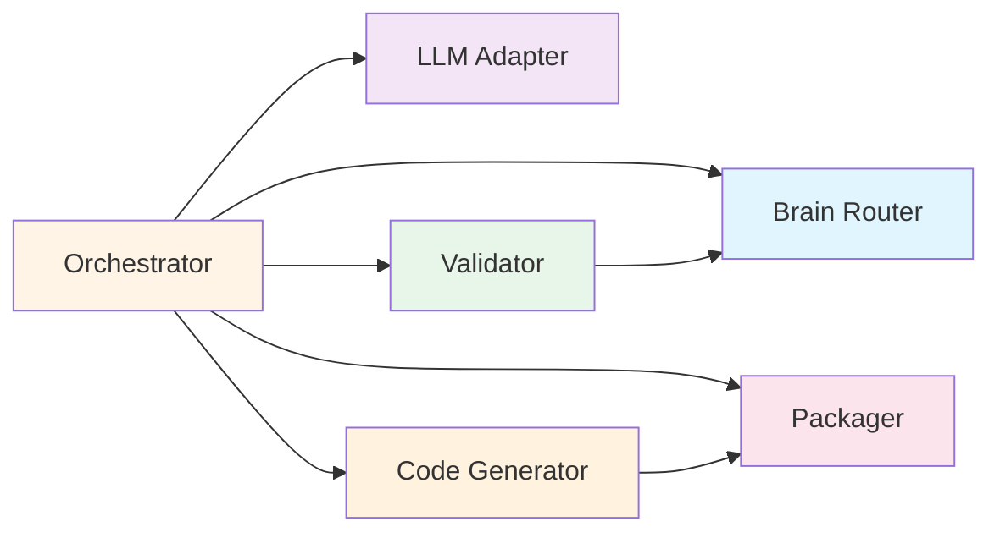

# Service Specifications

## Overview

This document provides detailed specifications for each service in the PCF Component Builder.

---

## 1. Component Builder Orchestrator

**Type**: Stateless service  
**Technology**: Node.js / TypeScript  
**Interface**: `IOrchestrator`

### Responsibilities
- Execute 7-stage workflow pipeline
- Coordinate service calls
- Manage build state persistence
- Handle errors and retries
- Maintain audit trail

### Key Methods

```typescript
interface IOrchestrator {
  buildComponent(userPrompt: string, config: BuilderConfig): Promise<BuildResult>;
  executeStage(stage: WorkflowStage, context: StageContext): Promise<StageResult>;
  resumeBuild(buildId: string, options: ResumeOptions): Promise<BuildResult>;
  handleDowngrade(downgrade: Downgrade): void;
  handleRejection(rejection: Rejection): RejectionResponse;
}
```

### Configuration

```typescript
interface BuilderConfig {
  namespace: string;              // Component namespace
  defaultVisualStyle?: string;    // Default visual style
  defaultWcagLevel?: string;      // Default WCAG level
  llmProvider: 'openai' | 'anthropic' | 'azure';
  llmModel: string;               // Model name
  maxRetries?: number;            // Max retry attempts (default: 3)
  timeout?: number;               // Timeout in ms (default: 30000)
}
```

### Performance Targets
- Stage 1 (Intent): < 2s
- Stage 2 (Capability): < 100ms
- Stage 3 (Spec): < 3s
- Stage 4 (Rules): < 500ms
- Stage 5 (Final): < 100ms
- Stage 6 (Code Gen): < 1s
- Stage 7 (Package): < 500ms
- **Total**: < 7s end-to-end

**See**: [AI Orchestrator Specification](orchestrator.md) for complete design

---

## 2. Brain Router

**Type**: Stateless service with caching  
**Technology**: Node.js / TypeScript  
**Interface**: `IBrainRouter`

### Responsibilities
- Load AI Brain files selectively
- Parse JSON schemas and rules
- Cache frequently accessed files
- Provide typed access to brain artifacts

### Key Methods

```typescript
interface IBrainRouter {
  loadForStage(stage: WorkflowStage): Promise<BrainArtifacts>;
  loadWithContext(context: LoadContext): Promise<BrainArtifacts>;
  getSchema(schemaId: string): Promise<JSONSchema>;
  getCapability(capabilityId: string): Promise<Capability>;
  getRules(category: string): Promise<ValidationRule[]>;
  getAllRules(): Promise<ValidationRule[]>;
  getPromptTemplate(promptId: string): Promise<PromptTemplate>;
  clearCache(): void;
}
```

### Loading Strategy

| Stage | Files Loaded |
|-------|-------------|
| 1 | `global-intent.schema.json`, `intent-mapping.rules.json`, `ambiguity-resolution.rules.json`, `intent-interpreter.prompt.md` |
| 2 | `registry.index.json`, `{capability}.capability.json` |
| 3 | `component-spec.schema.json`, `{capability}.capability.json`, `component-spec-generator.prompt.md` |
| 4 | `pcf-core.rules.md`, `pcf-performance.rules.md`, `pcf-accessibility.rules.md` |
| 5 | `component-spec.schema.json`, `{capability}.capability.json` |

### Caching Strategy
- **Cache Layer**: Redis
- **TTL**: 3600 seconds (1 hour)
- **Cache Key Format**: `brain:{type}:{id}`
- **Invalidation**: Manual or on version update

### Performance Targets
- Cache hit: < 10ms
- Cache miss: < 50ms (file read)
- Schema parsing: < 20ms

---

## 3. LLM Service Adapter

**Type**: Stateless service  
**Technology**: Node.js / TypeScript  
**Interface**: `ILLMAdapter`

### Responsibilities
- Assemble prompts from templates
- Execute LLM API calls
- Parse and validate responses
- Handle retries with backoff
- Support multiple LLM providers

### Key Methods

```typescript
interface ILLMAdapter {
  executePrompt(
    template: PromptTemplate,
    context: PromptContext,
    schema: JSONSchema
  ): Promise<LLMResult>;
  
  validateResponse(response: string, schema: JSONSchema): SchemaValidationResult;
  retryWithBackoff<T>(operation: () => Promise<T>, maxRetries?: number): Promise<T>;
  setProvider(provider: string, config: any): void;
}
```

### Supported Providers

| Provider | SDK | Models |
|----------|-----|--------|
| OpenAI | `openai` | gpt-4, gpt-4-turbo, gpt-3.5-turbo |
| Anthropic | `@anthropic-ai/sdk` | claude-3-opus, claude-3-sonnet |
| Azure OpenAI | `@azure/openai` | gpt-4, gpt-35-turbo |

### Retry Strategy

| Error Type | Max Retries | Backoff |
|------------|-------------|---------|
| Timeout | 3 | Exponential (1s, 2s, 4s) |
| Rate Limit | 5 | Exponential (1s, 2s, 4s, 8s, 16s) |
| Invalid Response | 2 | Linear (1s, 1s) |
| Network Error | 3 | Exponential (1s, 2s, 4s) |

### Performance Targets
- Prompt assembly: < 100ms
- LLM call: < 3s (provider-dependent)
- Response parsing: < 50ms
- Validation: < 100ms

---

## 4. Validator Engine

**Type**: Stateless service  
**Technology**: Node.js / TypeScript  
**Interface**: `IValidator`

### Responsibilities
- Validate JSON against schemas
- Execute validation rules
- Apply auto-fixes
- Apply downgrades
- Generate validation reports

### Key Methods

```typescript
interface IValidator {
  validateSchema(data: unknown, schema: JSONSchema): SchemaValidationResult;
  executeRules(spec: ComponentSpec, rules: ValidationRule[]): Promise<RuleValidationResult>;
  applyDowngrade(spec: ComponentSpec, downgrade: any): ComponentSpec;
  generateReport(results: any[]): ValidationReport;
  crossReference(spec: ComponentSpec, capability: Capability): SchemaValidationResult;
}
```

### Schema Validation
- **Library**: Ajv (JSON Schema Draft-07)
- **Strict Mode**: Enabled
- **Additional Properties**: Disallowed by default

### Rule Execution

**Rule Categories**:
- PCF Core (15 rules)
- Performance (10 rules)
- Accessibility (9 rules)

**Severity Levels**:
- **error**: Reject build
- **warning**: Apply auto-fix or downgrade
- **info**: Document only

### Performance Targets
- Schema validation: < 50ms
- Rule execution (34 rules): < 500ms
- Auto-fix application: < 100ms
- Report generation: < 50ms

---

## 5. Code Generator

**Type**: Stateless service  
**Technology**: Node.js / TypeScript + Handlebars  
**Interface**: `ICodeGenerator`

### Responsibilities
- Load code templates
- Render templates with spec data
- Generate TypeScript, XML, CSS, RESX
- Lint generated code
- Bundle resources

### Key Methods

```typescript
interface ICodeGenerator {
  generate(spec: ComponentSpec, capability: Capability): Promise<{
    files: GeneratedFile[];
    metadata: GenerationMetadata;
  }>;
  
  generateImplementation(spec: ComponentSpec): Promise<GeneratedFile>;
  generateManifest(spec: ComponentSpec): Promise<GeneratedFile>;
  generateStyles(spec: ComponentSpec): Promise<GeneratedFile>;
  generateResources(spec: ComponentSpec): Promise<GeneratedFile[]>;
  applyTemplate(template: any, spec: ComponentSpec): string;
}
```

### Template Engine
- **Engine**: Handlebars
- **Helpers**: Custom helpers for PCF-specific logic
- **Partials**: Reusable template fragments

### Generated Files

| File | Template | Validation |
|------|----------|------------|
| `index.ts` | `index.ts.template` | ESLint + TypeScript |
| `ControlManifest.Input.xml` | `ControlManifest.Input.xml.template` | XML schema |
| `styles.css` | `styles.css.template` | CSS linting |
| `strings.resx` | `strings.resx.template` | XML schema |

### Performance Targets
- Template loading: < 50ms
- Template rendering: < 500ms per file
- Linting: < 300ms
- Total: < 1s for all files

---

## 6. PCF Packager

**Type**: Stateless service  
**Technology**: Node.js / TypeScript + JSZip  
**Interface**: `IPackager`

### Responsibilities
- Create PCF folder structure
- Generate package.json
- Generate pcfconfig.json
- Bundle resources
- Create ZIP file
- Validate package structure

### Key Methods

```typescript
interface IPackager {
  createZip(files: GeneratedFile[], spec: ComponentSpec): Promise<{
    zipBuffer: Buffer;
    manifest: PackageManifest;
  }>;
  
  createPackageStructure(files: GeneratedFile[]): FileTree;
  generatePackageJson(spec: ComponentSpec): any;
  bundleResources(files: GeneratedFile[]): any;
  validatePackage(zipBuffer: Buffer): SchemaValidationResult;
}
```

### Package Structure

```
component-name/
├── package.json              # npm package definition
├── pcfconfig.json           # PCF configuration
├── ControlManifest.Input.xml # PCF manifest
├── index.ts                 # TypeScript implementation
├── styles.css               # Component styles
├── strings.resx             # Localization
└── README.md                # Component documentation
```

### package.json Template

```json
{
  "name": "{namespace}.{componentName}",
  "version": "1.0.0",
  "description": "{description}",
  "scripts": {
    "build": "pcf-scripts build",
    "start": "pcf-scripts start"
  },
  "dependencies": {
    "@types/powerapps-component-framework": "^1.3.0"
  },
  "devDependencies": {
    "pcf-scripts": "^1.0.0",
    "pcf-start": "^1.0.0"
  }
}
```

### Performance Targets
- Structure creation: < 100ms
- File bundling: < 200ms
- ZIP creation: < 200ms
- Validation: < 100ms
- Total: < 500ms

---

## Service Dependencies



---

## Deployment Considerations

### Containerization

Each service can be containerized independently:

```dockerfile
FROM node:20-alpine
WORKDIR /app
COPY package*.json ./
RUN npm ci --production
COPY . .
EXPOSE 3000
CMD ["node", "dist/index.js"]
```

### Environment Variables

```bash
# Orchestrator
ORCHESTRATOR_PORT=3000
BUILD_STORAGE_PATH=/data/builds
AUDIT_LOG_PATH=/data/audit

# Brain Router
BRAIN_PATH=/app/ai-brain
REDIS_URL=redis://localhost:6379
CACHE_TTL=3600

# LLM Adapter
LLM_PROVIDER=openai
OPENAI_API_KEY=sk-...
ANTHROPIC_API_KEY=sk-ant-...
AZURE_OPENAI_ENDPOINT=https://...

# Validator
VALIDATION_STRICT_MODE=true

# Code Generator
TEMPLATES_PATH=/app/templates

# Packager
TEMP_DIR=/tmp/packages
```

---

## Monitoring and Observability

### Metrics to Track

| Service | Metrics |
|---------|---------|
| Orchestrator | Build success rate, stage duration, error rate |
| Brain Router | Cache hit rate, file load time, cache size |
| LLM Adapter | API call duration, token usage, retry rate |
| Validator | Rule execution time, validation failures |
| Code Generator | Template render time, linting failures |
| Packager | ZIP creation time, package size |

### Health Checks

Each service exposes `/health` endpoint:

```json
{
  "status": "healthy",
  "uptime": 3600,
  "version": "1.0.0",
  "dependencies": {
    "redis": "connected",
    "llm": "available"
  }
}
```

---

## Summary

All services follow these principles:
- ✅ **Stateless** - State persisted externally
- ✅ **Single Responsibility** - One clear purpose
- ✅ **Interface-Based** - TypeScript contracts
- ✅ **Independently Testable** - Mockable dependencies
- ✅ **Horizontally Scalable** - No session affinity
- ✅ **Observable** - Metrics and health checks
