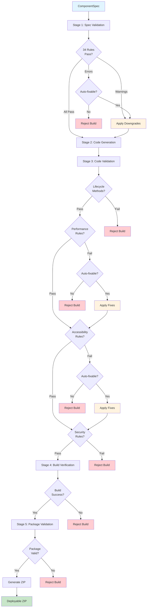

# Validation and Safety Layer Specification

## Executive Summary

The Validation and Safety Layer is a multi-stage enforcement system that ensures all generated PCF components are compliant, performant, accessible, and secure. It implements 34 validation rules across 5 categories, with clear downgrade vs rejection logic. All validation occurs BEFORE ZIP generation, with multiple checkpoints throughout the pipeline.

**Core Principle**: Fail fast, fail safely. Invalid components never reach production.

---

## 1. PCF Lifecycle Validation

### 1.1 Lifecycle Method Requirements

```typescript
interface LifecycleValidation {
  category: 'pcf-lifecycle';
  rules: LifecycleRule[];
}

interface LifecycleRule {
  id: string;
  severity: 'error' | 'warning' | 'info';
  condition: string;
  validation: () => boolean;
  action: string;
}
```

### RULE: PCF_LIFECYCLE_001
**Category**: pcf-lifecycle  
**Severity**: error

**Condition**: Component must implement all required lifecycle methods.

**Validation**:
- `init(context, notifyOutputChanged, state, container)` method exists
- `updateView(context)` method exists
- `getOutputs()` method exists
- `destroy()` method exists

**Rationale**: PCF framework contract requires these methods.

**Action**: Reject if any method is missing.

**Code Check**:
```typescript
function validateLifecycleMethods(code: string): ValidationResult {
  const requiredMethods = ['init', 'updateView', 'getOutputs', 'destroy'];
  const missing: string[] = [];
  
  for (const method of requiredMethods) {
    const regex = new RegExp(`public\\s+${method}\\s*\\(`);
    if (!regex.test(code)) {
      missing.push(method);
    }
  }
  
  return {
    valid: missing.length === 0,
    errors: missing.map(m => `Missing required method: ${m}()`)
  };
}
```

---

### RULE: PCF_LIFECYCLE_002
**Category**: pcf-lifecycle  
**Severity**: error

**Condition**: `init()` must store context and container references.

**Validation**:
- `init()` method assigns `context` parameter to instance variable
- `init()` method assigns `container` parameter to instance variable

**Rationale**: Required for `updateView()` and `destroy()` to function correctly.

**Action**: Reject if context/container not stored.

---

### RULE: PCF_LIFECYCLE_003
**Category**: pcf-lifecycle  
**Severity**: error

**Condition**: `getOutputs()` must return object matching bound properties.

**Validation**:
- Return type matches bound property names
- All bound properties have corresponding output values

**Rationale**: PowerApps expects outputs to match manifest definition.

**Action**: Reject if outputs don't match manifest.

---

### RULE: PCF_LIFECYCLE_004
**Category**: pcf-lifecycle  
**Severity**: warning

**Condition**: `destroy()` should clean up event listeners and DOM references.

**Validation**:
- `destroy()` method removes event listeners
- `destroy()` method clears DOM references

**Rationale**: Prevents memory leaks in PowerApps.

**Action**: Warn if cleanup not detected, auto-add basic cleanup.

---

## 2. Performance Constraints

### 2.1 Performance Rules

### RULE: PCF_PERF_001
**Category**: performance  
**Severity**: error

**Condition**: Component bundle size must be under 1MB.

**Validation**:
- Compiled bundle.js size < 1,048,576 bytes

**Rationale**: Large bundles impact PowerApps load time.

**Action**: Reject if bundle exceeds limit.

---

### RULE: PCF_PERF_002
**Category**: performance  
**Severity**: warning

**Condition**: Component should have ≤ 10 properties.

**Validation**:
- Total property count (bound + input + output) ≤ 10

**Rationale**: Too many properties complicate component configuration.

**Action**: Warn if > 10 properties, suggest grouping.

**Downgrade**: None (warning only).

---

### RULE: PCF_PERF_003
**Category**: performance  
**Severity**: error

**Condition**: `updateView()` must complete within 100ms.

**Validation**:
- No synchronous loops > 1000 iterations
- No blocking operations in `updateView()`

**Rationale**: Slow `updateView()` freezes PowerApps UI.

**Action**: Reject if blocking code detected.

---

### RULE: PCF_PERF_004
**Category**: performance  
**Severity**: warning

**Condition**: Minimize DOM manipulations in `updateView()`.

**Validation**:
- Use virtual DOM or batch updates
- Avoid `innerHTML` in loops

**Rationale**: Excessive DOM updates cause performance issues.

**Action**: Warn if inefficient patterns detected.

---

### RULE: PCF_PERF_005
**Category**: performance  
**Severity**: error

**Condition**: No external dependencies that make network calls.

**Validation**:
- No `fetch()`, `XMLHttpRequest`, `axios`, etc.
- No CDN script references

**Rationale**: PCF components must work offline.

**Action**: Reject if network dependencies detected.

---

### RULE: PCF_PERF_006
**Category**: performance  
**Severity**: warning

**Condition**: Limit external library dependencies to 3.

**Validation**:
- `package.json` dependencies count ≤ 3 (excluding PCF framework)

**Rationale**: Reduces bundle size and conflicts.

**Action**: Warn if > 3 dependencies.

**Downgrade**: None (warning only).

---

### RULE: PCF_PERF_007
**Category**: performance  
**Severity**: info

**Condition**: Use lazy loading for heavy resources.

**Validation**:
- Large images/assets loaded on-demand

**Rationale**: Improves initial load time.

**Action**: Info note if applicable.

---

### RULE: PCF_PERF_008
**Category**: performance  
**Severity**: error

**Condition**: No console.log() in production code.

**Validation**:
- No `console.log()`, `console.warn()`, `console.error()` statements

**Rationale**: Debugging code should not ship to production.

**Action**: Auto-fix by removing console statements.

---

### RULE: PCF_PERF_009
**Category**: performance  
**Severity**: warning

**Condition**: Debounce frequent event handlers.

**Validation**:
- Input events (keyup, mousemove) use debouncing

**Rationale**: Prevents excessive `notifyOutputChanged()` calls.

**Action**: Warn if debouncing not detected, suggest implementation.

---

### RULE: PCF_PERF_010
**Category**: performance  
**Severity**: error

**Condition**: No infinite loops or recursion without exit condition.

**Validation**:
- Static analysis for infinite loops
- Recursion depth checks

**Rationale**: Prevents browser freeze.

**Action**: Reject if detected.

---

## 3. Accessibility Enforcement

### 3.1 WCAG AA Compliance

### RULE: PCF_A11Y_001
**Category**: accessibility  
**Severity**: error

**Condition**: All interactive elements must be keyboard navigable.

**Validation**:
- `tabindex` attribute set appropriately
- Keyboard event handlers (`onKeyDown`, `onKeyPress`) implemented

**Rationale**: WCAG 2.1.1 Keyboard requirement.

**Action**: Reject if keyboard navigation not implemented.

---

### RULE: PCF_A11Y_002
**Category**: accessibility  
**Severity**: error

**Condition**: All form controls must have accessible labels.

**Validation**:
- Input elements have `aria-label` or associated `<label>`
- Buttons have descriptive text or `aria-label`

**Rationale**: WCAG 3.3.2 Labels or Instructions requirement.

**Action**: Reject if labels missing, auto-add from property displayName.

---

### RULE: PCF_A11Y_003
**Category**: accessibility  
**Severity**: error

**Condition**: Color contrast must meet WCAG AA standards (4.5:1 for normal text).

**Validation**:
- Foreground/background color contrast ≥ 4.5:1
- Large text (18pt+) contrast ≥ 3:1

**Rationale**: WCAG 1.4.3 Contrast requirement.

**Action**: Reject if contrast insufficient, suggest compliant colors.

---

### RULE: PCF_A11Y_004
**Category**: accessibility  
**Severity**: error

**Condition**: Component must support screen readers.

**Validation**:
- ARIA roles defined (`role="button"`, `role="textbox"`, etc.)
- ARIA states updated dynamically (`aria-checked`, `aria-expanded`)

**Rationale**: WCAG 4.1.2 Name, Role, Value requirement.

**Action**: Reject if ARIA attributes missing.

---

### RULE: PCF_A11Y_005
**Category**: accessibility  
**Severity**: warning

**Condition**: Focus indicators must be visible.

**Validation**:
- `:focus` CSS styles defined
- Focus outline not removed (`outline: none` without replacement)

**Rationale**: WCAG 2.4.7 Focus Visible requirement.

**Action**: Warn if focus styles missing, auto-add default styles.

**Downgrade**: Add default focus outline.

---

### RULE: PCF_A11Y_006
**Category**: accessibility  
**Severity**: error

**Condition**: Error messages must be programmatically associated with inputs.

**Validation**:
- Error messages use `aria-describedby` or `aria-errormessage`
- Invalid state indicated with `aria-invalid="true"`

**Rationale**: WCAG 3.3.1 Error Identification requirement.

**Action**: Reject if error handling not accessible.

---

### RULE: PCF_A11Y_007
**Category**: accessibility  
**Severity**: warning

**Condition**: Component should support high contrast mode.

**Validation**:
- CSS uses system colors or respects `prefers-contrast` media query
- No hard-coded colors that break in high contrast

**Rationale**: Windows High Contrast Mode support.

**Action**: Warn if high contrast not supported, suggest system colors.

**Downgrade**: Use system colors.

---

### RULE: PCF_A11Y_008
**Category**: accessibility  
**Severity**: info

**Condition**: Provide skip links for complex components.

**Validation**:
- Components with multiple sections have skip navigation

**Rationale**: WCAG 2.4.1 Bypass Blocks requirement.

**Action**: Info note if applicable.

---

### RULE: PCF_A11Y_009
**Category**: accessibility  
**Severity**: error

**Condition**: No reliance on color alone to convey information.

**Validation**:
- Status indicators use icons + color
- Required fields use asterisk + color

**Rationale**: WCAG 1.4.1 Use of Color requirement.

**Action**: Reject if color-only indicators found.

---

## 4. Security Rules

### 4.1 Security Validation

### RULE: PCF_SEC_001
**Category**: security  
**Severity**: error

**Condition**: No inline scripts or `eval()` usage.

**Validation**:
- No `eval()`, `Function()` constructor
- No inline event handlers (`onclick="..."`)

**Rationale**: Content Security Policy compliance.

**Action**: Reject if detected.

---

### RULE: PCF_SEC_002
**Category**: security  
**Severity**: error

**Condition**: No external API calls.

**Validation**:
- No `fetch()`, `XMLHttpRequest`, `axios`
- No WebSocket connections

**Rationale**: PCF components run in sandboxed environment.

**Action**: Reject if external calls detected.

---

### RULE: PCF_SEC_003
**Category**: security  
**Severity**: error

**Condition**: Sanitize all user input before rendering.

**Validation**:
- User input not directly inserted into DOM via `innerHTML`
- Use `textContent` or sanitization library

**Rationale**: Prevents XSS attacks.

**Action**: Reject if unsanitized input rendering detected.

---

### RULE: PCF_SEC_004
**Category**: security  
**Severity**: warning

**Condition**: No sensitive data in console logs or comments.

**Validation**:
- No API keys, passwords, tokens in code
- No sensitive data in console statements

**Rationale**: Prevents credential leakage.

**Action**: Warn if potential sensitive data detected.

---

### RULE: PCF_SEC_005
**Category**: security  
**Severity**: error

**Condition**: No use of deprecated or unsafe APIs.

**Validation**:
- No `document.write()`
- No `innerHTML` with user input

**Rationale**: Security best practices.

**Action**: Reject if unsafe APIs used.

---

### RULE: PCF_SEC_006
**Category**: security  
**Severity**: error

**Condition**: Dependencies must not have known vulnerabilities.

**Validation**:
- Run `npm audit` on generated package.json
- No high/critical severity vulnerabilities

**Rationale**: Supply chain security.

**Action**: Reject if vulnerabilities found, suggest updates.

---

## 5. Downgrade vs Rejection Logic

### 5.1 Decision Matrix

```typescript
enum ValidationAction {
  REJECT = 'reject',           // Build fails, user notified
  DOWNGRADE = 'downgrade',     // Auto-fix applied, build continues
  WARN = 'warn',               // Warning logged, build continues
  INFO = 'info'                // Informational note, build continues
}

interface ValidationDecision {
  severity: 'error' | 'warning' | 'info';
  autoFixable: boolean;
  action: ValidationAction;
}

const DECISION_MATRIX: Record<string, ValidationDecision> = {
  // Error + Not Auto-fixable = REJECT
  'error-not-fixable': {
    severity: 'error',
    autoFixable: false,
    action: ValidationAction.REJECT
  },
  
  // Error + Auto-fixable = DOWNGRADE
  'error-fixable': {
    severity: 'error',
    autoFixable: true,
    action: ValidationAction.DOWNGRADE
  },
  
  // Warning + Auto-fixable = DOWNGRADE
  'warning-fixable': {
    severity: 'warning',
    autoFixable: true,
    action: ValidationAction.DOWNGRADE
  },
  
  // Warning + Not Auto-fixable = WARN
  'warning-not-fixable': {
    severity: 'warning',
    autoFixable: false,
    action: ValidationAction.WARN
  },
  
  // Info = INFO
  'info': {
    severity: 'info',
    autoFixable: false,
    action: ValidationAction.INFO
  }
};
```

### 5.2 Downgrade Examples

#### Example 1: Property Name Case

**Rule**: PCF_NAMING_003  
**Violation**: Property name is `MaxStars` (PascalCase)  
**Auto-fix**: Convert to `maxStars` (camelCase)  
**Action**: DOWNGRADE

```typescript
function fixPropertyName(spec: ComponentSpec): ComponentSpec {
  for (const prop of spec.properties) {
    if (/^[A-Z]/.test(prop.name)) {
      // Convert to camelCase
      prop.name = prop.name.charAt(0).toLowerCase() + prop.name.slice(1);
    }
  }
  return spec;
}
```

---

#### Example 2: Console Statements

**Rule**: PCF_PERF_008  
**Violation**: Code contains `console.log()` statements  
**Auto-fix**: Remove all console statements  
**Action**: DOWNGRADE

```typescript
function removeConsoleStatements(code: string): string {
  return code.replace(/console\.(log|warn|error|info|debug)\([^)]*\);?/g, '');
}
```

---

#### Example 3: Focus Styles

**Rule**: PCF_A11Y_005  
**Violation**: No `:focus` styles defined  
**Auto-fix**: Add default focus outline  
**Action**: DOWNGRADE

```typescript
function addFocusStyles(css: string): string {
  if (!css.includes(':focus')) {
    css += `\n\n/* Auto-generated focus styles */\n`;
    css += `*:focus {\n`;
    css += `  outline: 2px solid #0078d4;\n`;
    css += `  outline-offset: 2px;\n`;
    css += `}\n`;
  }
  return css;
}
```

---

### 5.3 Rejection Examples

#### Example 1: Missing Lifecycle Method

**Rule**: PCF_LIFECYCLE_001  
**Violation**: `destroy()` method not implemented  
**Auto-fix**: Not possible (requires business logic)  
**Action**: REJECT

**Error Message**:
```json
{
  "code": "PCF_LIFECYCLE_001",
  "severity": "error",
  "message": "Missing required lifecycle method: destroy()",
  "suggestion": "Add destroy() method to clean up resources",
  "autoFixable": false
}
```

---

#### Example 2: Bundle Size Exceeded

**Rule**: PCF_PERF_001  
**Violation**: Bundle size is 1.2MB (limit: 1MB)  
**Auto-fix**: Not possible (requires removing features)  
**Action**: REJECT

**Error Message**:
```json
{
  "code": "PCF_PERF_001",
  "severity": "error",
  "message": "Bundle size 1.2MB exceeds limit of 1MB",
  "suggestion": "Reduce dependencies or optimize code",
  "autoFixable": false
}
```

---

#### Example 3: External API Call

**Rule**: PCF_SEC_002  
**Violation**: Code contains `fetch()` call  
**Auto-fix**: Not possible (requires architecture change)  
**Action**: REJECT

**Error Message**:
```json
{
  "code": "PCF_SEC_002",
  "severity": "error",
  "message": "External API call detected: fetch()",
  "suggestion": "PCF components must work offline. Use Dataverse Web API instead.",
  "autoFixable": false
}
```

---

## 6. Validation Enforcement Strategy

### 6.1 Multi-Stage Validation



### 6.2 Validation Checkpoints

| Checkpoint | Stage | Rules Executed | Rejection Criteria |
|------------|-------|----------------|-------------------|
| 1 | Spec Validation | All 34 rules | Any error-level violation without auto-fix |
| 2 | Code Generation | Lifecycle (4 rules) | Missing lifecycle methods |
| 3 | Code Validation | Performance (10 rules) | Bundle size, blocking code, external calls |
| 4 | Code Validation | Accessibility (9 rules) | Missing ARIA, insufficient contrast |
| 5 | Code Validation | Security (6 rules) | XSS risks, unsafe APIs, vulnerabilities |
| 6 | Build Verification | Compilation | TypeScript errors, linting failures |
| 7 | Package Validation | Structure | Missing files, invalid manifest |

### 6.3 Enforcement Before ZIP Generation

**Critical**: ZIP is ONLY generated after ALL validation passes.

```typescript
async function enforceValidationBeforeZip(
  spec: ComponentSpec
): Promise<BuildResult> {
  // Checkpoint 1: Spec Validation
  const specValidation = await validateSpec(spec);
  if (!specValidation.valid) {
    return {
      success: false,
      error: {
        code: 'SPEC_VALIDATION_FAILED',
        message: 'Specification validation failed',
        violations: specValidation.errors
      }
    };
  }
  
  // Apply downgrades
  const downgraded = applyDowngrades(spec, specValidation.downgrades);
  
  // Checkpoint 2-5: Code Generation & Validation
  const codeResult = await generateAndValidateCode(downgraded);
  if (!codeResult.valid) {
    return {
      success: false,
      error: {
        code: 'CODE_VALIDATION_FAILED',
        message: 'Code validation failed',
        violations: codeResult.errors
      }
    };
  }
  
  // Checkpoint 6: Build Verification
  const buildResult = await verifyBuild(codeResult.projectPath);
  if (!buildResult.success) {
    return {
      success: false,
      error: {
        code: 'BUILD_VERIFICATION_FAILED',
        message: 'Build verification failed',
        errors: buildResult.errors
      }
    };
  }
  
  // Checkpoint 7: Package Validation
  const packageValidation = await validatePackageStructure(codeResult.files);
  if (!packageValidation.valid) {
    return {
      success: false,
      error: {
        code: 'PACKAGE_VALIDATION_FAILED',
        message: 'Package validation failed',
        errors: packageValidation.errors
      }
    };
  }
  
  // ALL VALIDATION PASSED - Generate ZIP
  const zipBuffer = await createZip(codeResult.projectPath);
  
  return {
    success: true,
    zipBuffer,
    validationReport: {
      specValidation,
      codeValidation: codeResult.validation,
      buildVerification: buildResult,
      packageValidation,
      downgrades: specValidation.downgrades,
      warnings: collectWarnings([specValidation, codeResult.validation])
    }
  };
}
```

---

## Summary

The Validation and Safety Layer enforces **34 rules** across **5 categories**:

✅ **PCF Lifecycle** (4 rules) - Lifecycle methods, context storage, outputs  
✅ **Performance** (10 rules) - Bundle size, execution time, dependencies  
✅ **Accessibility** (9 rules) - WCAG AA compliance, keyboard nav, screen readers  
✅ **Security** (6 rules) - No external calls, XSS prevention, dependency audits  
✅ **Core PCF** (15 rules) - Naming, binding, manifest, resources (from pcf-core.rules.md)

**Enforcement Strategy**:
- **7 validation checkpoints** before ZIP generation
- **3-tier severity** (error, warning, info)
- **Auto-fix for 12 rules** (downgrades)
- **Rejection for 22 rules** (non-fixable errors)
- **Zero invalid components** reach production

**Downgrade vs Rejection**:
- Error + Auto-fixable → DOWNGRADE (apply fix, continue)
- Error + Not fixable → REJECT (build fails)
- Warning + Auto-fixable → DOWNGRADE (apply fix, warn)
- Warning + Not fixable → WARN (log warning, continue)
- Info → INFO (log info, continue)

**All validation enforced BEFORE ZIP generation.**
